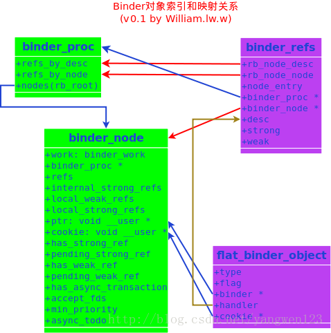
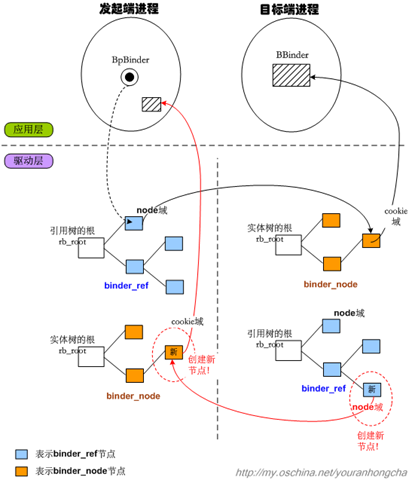
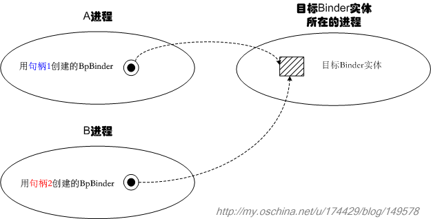
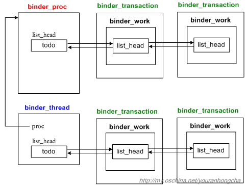
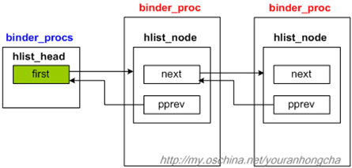
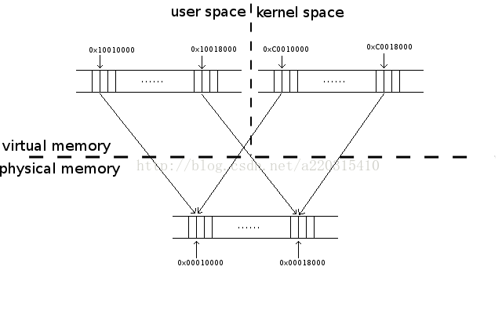

## Binder驱动原理
Binder驱动的核心是维护一个binder_proc类型的链表。里面记录了包括ServiceManager在内的所有Client信息，当Client去请求得到某个Service时，Binder驱动就去binder_proc中查找相应的Service返回给Client，同时增加当前Service的引用个数。

Binder驱动是作为一个特殊字符型设备存在，设备节点为/dev/binder，遵循Linux设备驱动模型。在驱动实现过程中，主要通过binder_ioctl函数与用户空间的进程交换数据。BINDER_WRITE_READ用来读写数据，数据包中有个cmd用于区分不同的请求。
在binder_thread_write函数中调用binder_transaction函数来转发请求并返回结果，而binder_thread_read函数用于读取结果。。当服务进程收到请求时，binder_transaction函数会通过对象的handle找到对象所在进程，如果handle为0，就认为请求的是ServiceManager进程。

## 对象的索引和映射

Binder中有两种索引，一是本地进程地址空间的一个地址，另一个是一个抽象的32位句柄（HANDLE），它们之间是互斥的：所有的进程本地对象的索引都是本地进程的一个地址(address, ptr, binder)，所有的远程进程的对象的索引都是一个句柄（handle）。对于发送者进程来说，索引就是一个远端对象的一个句柄，当Binder对象数据被发送到远端接收进程时，远端接受进程则会认为索引是一个本地对象地址，因此从第三方的角度来说，尽管名称不同，对于一次Binder调用，两种索引指的是同一个对象，Binder驱动则负责两种索引的映射，这样才能把数据发送给正确的进程。

对于Android的Binder来说，对象的索引和映射是通过binder_node和binder_ref两个核心数据结构来完成的，对于Binder本地对象，对象的Binder地址保存在binder_node->ptr里，对于远程对象，索引就保存在binder_ref->desc里，每一个binder_node都有一个binder_ref对象与之相联系，他们就是是通过ptr和desc来做映射的，如下图：



flat_binder_object就是进程间传递的Binder对象，每一个flat_binder_object对象内都有一个唯一的binder_node对象或者binder_ref对象.他们之间的查找过程如下：



如果发送的flat_binder_object.type=BINDER,

1. 在发送进程内查找flat_binder_object.binder对应的binder_node
1. 如果找到则执行步骤4，否则执行步骤3
1. 在发送进程内创建新的binder_node,binder_node.ptr=flat_binder_object.binder
1. 在接收进程内查找binder_node对应的binder_ref,如果找到则执行步骤6，否则执行步骤5
1. 在接收进程内创建新的binder_ref,binder_ref.node=binder_node,分配binder_ref.desc值
1. 修改flat_binder_object.type=HANDLE（BINDER_TYPE_BINDER->BINER_TYPE_HANDLE；BINDER_TYPE_WEAK_BINDER->BINDER_TYPE_WEAK_HANDLE).
1. 修改flat_binder_object.handle=binder_refs.desc

如果发送的flat_binder_object.type=HANDLE,

1.  在发送进程内查找flat_binder_object.handle对应的binder_ref,如果找到，执行步骤3，否则执行步骤2
1.  设置error为BR_FAILED_REPLY，执行步骤11（这里的设计，防止了Client通过蒙猜的方式进行非法通信
1.  binder_ref.node.proc是否为接收进程，如果是，则执行步骤4，否则执行步骤7
1.  设置flat_binder_obecjt.type=BINDER（BINDER_TYPE_HANDLE->BINDER_TYPE_BINDER;1.  BINDER_TYPE_WEAK_HANDLE->BINDER_TYPE_WEAK_BINDER)
1.  设置flat_binder_object.binder=binder_ref.node.binder.
1.  设置flat_binder_object.cookies=binder_ref.node.cookies,执行步骤11
1.  在接收进程内超找对应的binder_ref，如果未找到，执行步骤8，否则执行步骤10
1.  在接收进程内创建新的binder_ref
1.  设置binder_ref(接收进程）.node=binder_ref(发送进程）.node,并分配binder_refs（接收进程）.desc
1.  设置flat_binder_object.handle=binder_ref（接收进程）.desc
1.  结束

进程1的BpBinder在发起跨进程调用时，向binder驱动传入了自己记录的句柄值，binder驱动就会在“进程1对应的binder_proc结构”的引用树中查找和句柄值相符的binder_ref节点，一旦找到binder_ref节点，就可以通过该节点的node域找到对应的binder_node节点，这个目标binder_node当然是从属于进程2的binder_proc啦，不过不要紧，因为binder_ref和binder_node都处于binder驱动的地址空间中，所以是可以用指针直接指向的。目标binder_node节点的cookie域，记录的其实是进程2中BBinder的地址，binder驱动只需把这个值反映给应用层，应用层就可以直接拿到BBinder了。

Binder句柄:
句柄就是个简单的整数值，用来告诉Binder驱动我们想找的目标Binder实体是哪个。但是请注意，句柄只对发起端进程和Binder驱动有意义，A进程的句柄直接拿到B进程，是没什么意义的。也就是说，不同进程中指代相同Binder实体的句柄值可能是不同的。示意图如下：



ServiceManagerService 记录了所有系统service所对应的Binder句柄，它的核心功能就是维护好这些句柄值。后续，当用户进程需要获取某个系统service的代理时，SMS就会在内部按service名查找到合适的句柄值，并“逻辑上”传递给用户进程，于是用户进程会得到一个新的合法句柄值，这个新句柄值可能在数值上和SMS所记录的句柄值不同，然而，它们指代的却是同一个Service实体。句柄的合法性是由Binder驱动保证的，这一点我们不必担心

## 传输机制的大体运作
Binder IPC机制的大体思路是这样的，它将每次“传输并执行特定语义的”工作理解为一个小事务，既然所传输的数据是binder_transaction_data类型的，那么这种事务的类名可以相应地定为binder_transaction。系统中当然会有很多事务啦，那么发向同一个进程或线程的若干事务就必须串行化起来，因此binder驱动为进程节点（binder_proc）和线程节点（binder_thread）都设计了个todo队列。todo队列的职责就是“串行化地组织待处理的事务”。
下图绘制了一个进程节点，以及一个从属于该进程的线程节点，它们各带了两个待处理的事务（binder_transaction）：

这样看来，传输动作的基本目标就很明确了，就是想办法把发起端的一个binder_transaction节点，插入到目标端进程或其合适子线程的todo队列去。
可是，该怎么找目标进程和目标线程呢？基本做法是先从发起端的BpBinder开始，找到与其对应的binder_node节点，这个在前文阐述binder_proc的4棵红黑树时已经说过了，这里不再赘述。总之拿到目标binder_node之后，我们就可以通过其proc域，拿到目标进程对应的binder_proc了。如果偷懒的话，我们直接把binder_transaction节点插到这个binder_proc的todo链表去，就算完成传输动作了。当然，binder驱动做了一些更精细的调整。
binder驱动希望能把binder_transaction节点尽量放到目标进程里的某个线程去，这样可以充分利用这个进程中的binder工作线程。比如一个binder线程目前正睡着，它在等待其他某个线程做完某个事情后才会醒来，而那个工作又偏偏需要在当前这个binder_transaction事务处理结束后才能完成，那么我们就可以让那个睡着的线程先去做当前的binder_transaction事务，这就达到充分利用线程的目的了。反正不管怎么说，如果binder驱动可以找到一个合适的线程，它就会把binder_transaction节点插到它的todo队列去。而如果找不到合适的线程，还可以把节点插入目标binder_proc的todo队列。



## Binder 相关数据结构
这一部分内容可以用到的时候再看

### flat_binder_object
进程间传输的数据被称为Binder对象（Binder Object），它是一个`flat_binder_object`，binder驱动接收和返回的数据中，如果有BpBinder或者BBinder，都会转成一个`flat_binder_object`对象，然后再进行赋值或者解析，它的定义如下：
```c++
/*
    * This is the flattened representation of a Binder object for transfer
    * between processes.  The 'offsets' supplied as part of a binder transaction
    * contains offsets into the data where these structures occur.  The Binder
    * driver takes care of re-writing the structure type and data as it moves
    * between processes.
    */
struct flat_binder_object {  
    /* 8 bytes for large_flat_header. */  
    unsigned long        type;  
    unsigned long        flags;  
    /* 8 bytes of data. */  
    union {  
        void        *binder;    /* local object */  
        signed long    handle;        /* remote object */  
    };  
    /* extra data associated with local object */  
    void            *cookie;  
};  
```
其中type表示类型,flags描述了传输方式，比如同步、异步等。Android定义了五个（三大类）Binder类型，如下：
```c++
 enum {  
   BINDER_TYPE_BINDER      = B_PACK_CHARS('s', 'b', '*', B_TYPE_LARGE),  
   BINDER_TYPE_WEAK_BINDER  = B_PACK_CHARS('w', 'b', '*', B_TYPE_LARGE),  
   BINDER_TYPE_HANDLE    = B_PACK_CHARS('s', 'h', '*', B_TYPE_LARGE),  
   BINDER_TYPE_WEAK_HANDLE= B_PACK_CHARS('w', 'h', '*', B_TYPE_LARGE),  
   BINDER_TYPE_FD              = B_PACK_CHARS('f', 'd', '*', B_TYPE_LARGE),  
}; 

 enum transaction_flags {  
    TF_ONE_WAY    = 0x01,    /* this is a one-way call: async, no return */  
    TF_ROOT_OBJECT    = 0x04,    /* contents are the component's root object */  
    TF_STATUS_CODE    = 0x08,    /* contents are a 32-bit status code */  
    TF_ACCEPT_FDS    = 0x10,    /* allow replies with file descriptors */  
}; 
```
忽略强弱引用的差异，type可以分为三类BINDER、HANDLE、FD。 

* type为BINDER类型时，flat_binder_object代表binder_node,flat_binder_object.binder等于相应binder_node.ptr，指向Service用户空间的BBinder。
* type为HANDLE类型时，flat_binder_object代表binder_ref,flat_binder_object.handle等于相应binder_refs.desc,也就是等于Client用户空间BpBinder.handle。
* type为FD类型时，flat_binder_object代表文件Binder，flat_binder_object.handle是文件在进程内的文件号。

传输的数据是一个复用数据联合体，对于BINDER类型，数据就是一个binder本地对象，如果是HANDLE类型，这数据就是一个远程的handle对象。该如何理解本地binder对象和远程handle对象呢？其实它们都指向同一个对象，不过是从不同的角度来说。举例来说，假如A有个对象X，对于A来说，X就是一个本地的binder对象；如果B想访问A的X对象，这对于B来说，X就是一个handle。因此，从根本上来说handle和binder都指向X。本地对象还可以带有额外的数据，保存在cookie中。

### binder_node
`binder_node` 代表一个内核中的binder实体，每一个binder_node都关联到用户态的BBinder对象。
```c++
struct binder_node {
	int debug_id;
	struct binder_work work;//work.type=BINDER_WORK_NODE
	union {
		struct rb_node rb_node;//binder_node通过本节点，链入到binder_proc的nodes成员所指向的红黑树中
		struct hlist_node dead_node;
	};
	struct binder_proc *proc;//binder_node所属进程的binder_proc
	struct hlist_head refs;//binder_ref列表，储存了所有引用本binder_node的binder_ref
	int internal_strong_refs;//指向本binder_node的强binder_ref计数
	int local_weak_refs;//本地弱引用计数
	int local_strong_refs;//本地强引用计数
	void __user *ptr;//指向用户态Binder实例的指针，通常指向BBinder的弱引用
	void __user *cookie;//自定义数据，通常为指向BBinder的指针
	unsigned has_strong_ref : 1;
	unsigned pending_strong_ref : 1;
	unsigned has_weak_ref : 1;
	unsigned pending_weak_ref : 1;
	unsigned has_async_transaction : 1;
	unsigned accept_fds : 1;
	int min_priority : 8;//最低优先级
	struct list_head async_todo;//异步binder
};
```
### binder_ref
`binder_ref` 代表内核中的binder引用，用户态每一个有效的BpBinder都关联到特定的binder_ref。同时binder_ref总是关联到一个binder_node
```c++

struct binder_ref {
	/* Lookups needed: */
	/*   node + proc => ref (transaction) */
	/*   desc + proc => ref (transaction, inc/dec ref) */
	/*   node => refs + procs (proc exit) */
	int debug_id;
	struct rb_node rb_node_desc;//binder_ref通过本节点，链入到binder_proc的refs_by_desc所指向的红黑树中
	struct rb_node rb_node_node;//同上，链入到binder_proc的refs_by_node所指向的红黑树中
	struct hlist_node node_entry;//binder_ref通过本节点，链入到binder_node的refs成员所指向的双向链表中
	struct binder_proc *proc;//所属的binder_proc
	struct binder_node *node;//所指向的binder_node
	uint32_t desc;//序号,等于BpBinder.mhandle
	int strong;//强引用计数
	int weak;//弱引用计数
	struct binder_ref_death *death;//Binder死亡通知
};
```
### binder_proc
binder_pro代表了使用binder driver的process，保存了process的相关信息。binder driver会为每一个调用过open函数打开“dev/binder”文件的进程创建一个binder_proc.
```c++
 //binder_proc的结构
struct binder_proc {
	struct hlist_node proc_node; //全局binder_proc列表，双向列表
	struct rb_root threads; //binder_thread红黑树，process内使用binder driver的线程都会被保存在这颗红黑树中
	struct rb_root nodes; //binder_node（binder实体）红黑树，process所持有的binder_node都保存在这颗红黑树中
	struct rb_root refs_by_desc;//binder_ref（binder引用）红黑树，process所持有的biner_refs都会保存在颗红黑树中，红黑树以binder_ref.desc排序
	struct rb_root refs_by_node;//同refs_by_desc，不过以binder_ref.node排序
	int pid;//进程号
	struct vm_area_struct *vma;//进程虚地址分配表
	struct task_struct *tsk;//进程描述符
	struct files_struct *files;//文件描述符列表
	struct hlist_node deferred_work_node;
	int deferred_work;
	void *buffer;//binder缓冲区在内核态的地址
	ptrdiff_t user_buffer_offset;//binder缓冲区在内核态地址与用户态地址的偏移量

	struct list_head buffers;//binder_buffer列表
	struct rb_root free_buffers;//空闲binder_buffer红黑树
	struct rb_root allocated_buffers;//已分配binder_buffer红黑树
	size_t free_async_space;
 
	struct page **pages;//内存分配页表
	size_t buffer_size;//binder缓冲区到大小
	uint32_t buffer_free;//空闲的binder缓冲区
	struct list_head todo;//binder_work列表，等待被处理的binder_work
	wait_queue_head_t wait;//linux内核等待队列，参考函数wait_event&wake_up
	struct binder_stats stats;
	struct list_head delivered_death;
	int max_threads;//最大线程数量
	int requested_threads;
	int requested_threads_started;
	int ready_threads;
	long default_priority;
};
```
### binder_procs
binder_procs结构的定义：
```c++
static HLIST_HEAD(binder_procs);
```
展开后得到
```c++
struct hlist_head binder_procs  = { .first = NULL };
```
随着后续不断向binder_procs表中添加节点，这个表会不断加长，示意图如下：



### binder_thread
binder_thread代表了binder_proc内的线程，保存了线程相关信息。binder driver会为每一个调用过ioctl函数操作“dev/binder”文件的线程创建binder_thread.
```c++
struct binder_thread {
    struct binder_proc *proc;//线程所属进程的binder_proc
    struct rb_node rb_node;//binder_thread通过rb_node链入到binder_proc的threads成员指向的红黑树中
    int pid;//线程号,为什么线程号也叫pid呢？
    int looper;
    struct binder_transaction *transaction_stack;//暂存binder_transaction
    struct list_head todo;//binder_work列表，等待被处理的binder_work
    uint32_t return_error; /* Write failed, return error code in read buf */
    uint32_t return_error2; /* Write failed, return error code in read */
        /* buffer. Used when sending a reply to a dead process that */
        /* we are also waiting on */
    wait_queue_head_t wait;//linux内核等待队列，参考函数wait_event&wake_up
    struct binder_stats stats;
};
```

### binder_write_read
binder_write_read为BINDER_WRITE_READ指定的数据类型，它的定义如下：
```c++
struct binder_write_read {
	signed long	write_size;	/* bytes to write */
	signed long	write_consumed;	/* bytes consumed by driver */
	unsigned long	write_buffer;
	signed long	read_size;	/* bytes to read */
	signed long	read_consumed;	/* bytes consumed by driver */
	unsigned long	read_buffer;
};
```
### binder_transaction_data
binder_transaction_data为写入协议BC_TRANSACTION、BC_REPLY以及读出协议BR_TRANSACTION、BR_REPLY所指定的数据类型，Binder驱动的使用者（e.i. Client、Service、Service Manager）通过binder_transaction_data和Binder driver进行数据交换。
```c++
struct binder_transaction_data {
	/* The first two are only used for bcTRANSACTION and brTRANSACTION,
	 * identifying the target and contents of the transaction.
	 */
	union {
		size_t	handle;	/* target descriptor of command transaction */
		void	*ptr;	/* target descriptor of return transaction */
	} target;
	void		*cookie;	/* target object cookie */
	unsigned int	code;		/* transaction command */ //Service自定义的指令码，以SeviceManager的addService为函数例的话，code=ADD_SERVICE_TRANSACTION
	/* General information about the transaction. */
	unsigned int	flags; //TF_ACCEPT_FDS TF_ONE_WAY
	pid_t		sender_pid; //发送方进程id
	uid_t		sender_euid; //发送方用户id
	size_t		data_size;	/* number of bytes of data */
	size_t		offsets_size;	/* number of bytes of offsets */

	/* If this transaction is inline, the data immediately
	 * follows here; otherwise, it ends with a pointer to
	 * the data buffer.
	 */
	union {
		struct { 
			/* transaction data */
			const void	*buffer; 
			/* offsets from buffer to flat_binder_object structs */
			const void	*offsets;
		} ptr;
		uint8_t	buf[8];
	} data;
};
```
就像注释中说明的那样，target成员和cookie成员仅在BC_TRANSACTION和BR_TRANSACTION协议中使用。通常，Client使用BC_TRANSACTION协议写入数据时，需要通过target.handle指定数据接收方。而Service读取到BR_TRANSACTION的binder_transaction_data.ptr成员保存了用户空间binder实体的地址（实际上，BBinder的弱引用地址），而cookie成员保存了用户数据（实际上，cookie才真正保存了BBinder的地址）。而使用BC_REPLY写入时，Binder driver忽略这两个参数，而读取到BR_REPLY的 binder_transaction_data的target和cookie成员则恒为空。 

最后，也是对于理解binder_transaction_data最重要的一点，binder_transaction_data结构体，并不包含传输的数据，而是通过其ptr.buffer成员保存了数据的内存地址。而ptr.offsets成员则保存了Binder对象（或者说flat_binder_object）在ptr.buffer的偏移量数组的首地址。data_size成员则记录了数据的长度，offsets_size则是编译量数组的长度（以字节为单位，所以，编译量数组实际的长度是offsets_size/4)。

## binder 用户接口
1. `binder_open()` 
    ```c++
    static int binder_open(struct inode *nodp, struct file *filp)
    {
        struct binder_proc *proc;
    
        . . . . . .
        proc = kzalloc(sizeof(*proc), GFP_KERNEL);
    
        get_task_struct(current);
        proc->tsk = current;
        . . . . . .
        hlist_add_head(&proc->proc_node, &binder_procs);
        proc->pid = current->group_leader->pid;
        . . . . . .
        filp->private_data = proc;
        . . . . . .
    }
    ```
    主要做了以下几件事情：
    
    1. 首先，binder驱动分配内存以保存binder_proc数据结构。然后，binder填充binder_proc数据（初始化），增加当前线程/进程的引用计数并赋值给tsk
    2. 增加BINDER_STAT_PROC的对象计数，并把创建的binder_proc对象添加到全局的binder_procs中，这样任何一个进程就都可以访问到其他进程的binder_proc对象了。
    3. 把binder_proc对象指针赋值给filp的private_data域中，在后面每次执行binder_ioctl()，都会从filp->private_data域重新读取binder_proc。
2. `binder_mmap()` 
    ```c++
    static int binder_mmap(struct file *filp, struct vm_area_struct *vma) {
        int ret;
        //需要映射的内核空间地址信息
        struct vm_struct *area;
        //取出binder_open时保存的binder_proc数据
        struct binder_proc *proc = filp->private_data;
        struct binder_buffer *buffer;

        //保证这块内存最多只有4M  
        if ((vma->vm_end - vma->vm_start) > SZ_4M)
            vma->vm_end = vma->vm_start + SZ_4M;

        vma->vm_flags = (vma->vm_flags | VM_DONTCOPY) & ~VM_MAYWRITE;

        //申请一段内存空间给内核进程
        area = get_vm_area(vma->vm_end - vma->vm_start, VM_IOREMAP);

        //得到映射的内核空间虚拟地址首地址
        proc->buffer = area->addr;
        //计算用户空间与映射的内核空间的地址偏移量
        proc->user_buffer_offset = vma->vm_start - (uintptr_t)proc->buffer;

        //得到映射地址的页数
        proc->pages = kzalloc(sizeof(proc->pages[0]) * ((vma->vm_end - vma->vm_start) / PAGE_SIZE), GFP_KERNEL);
        //映射空间的大小
        proc->buffer_size = vma->vm_end - vma->vm_start;

        vma->vm_ops = &binder_vm_ops;
        vma->vm_private_data = proc;

        //为虚拟地址空间proc->buffer ~ proc->buffer + PAGE_SIZE  分配一个空闲的物理页面
        if (binder_update_page_range(proc, 1, proc->buffer, proc->buffer + PAGE_SIZE, vma)) {
            ret = -ENOMEM;
            failure_string = "alloc small buf";
            goto err_alloc_small_buf_failed;
        }
        buffer = proc->buffer;
        INIT_LIST_HEAD(&proc->buffers);
        list_add(&buffer->entry, &proc->buffers);
        buffer->free = 1;
        binder_insert_free_buffer(proc, buffer);
        proc->free_async_space = proc->buffer_size / 2;
        barrier();
        proc->files = get_files_struct(current);
        proc->vma = vma;

        return 0;

    err_alloc_small_buf_failed:
        kfree(proc->pages);
        proc->pages = NULL;
    err_alloc_pages_failed:
        vfree(proc->buffer);
        proc->buffer = NULL;
    err_get_vm_area_failed:
    err_already_mapped:
    err_bad_arg:
        return ret;
    }

    static int binder_update_page_range(struct binder_proc *proc, int allocate, void *start, void *end, struct vm_area_struct *vma) {
        void *page_addr;
        unsigned long user_page_addr;
        struct vm_struct tmp_area;
        struct page **page;
        struct mm_struct *mm;
        //以页为单位分配物理页面，由于此时的end=start+PAGE_SIZE，因此只会循环一次
        for (page_addr = start; page_addr < end; page_addr += PAGE_SIZE) {
            int ret;
            struct page **page_array_ptr;
            page = &proc->pages[(page_addr - proc->buffer) / PAGE_SIZE];

            //分配物理页面
            *page = alloc_page(GFP_KERNEL | __GFP_ZERO);
            if (*page == NULL) {
                goto err_alloc_page_failed;
            }
            tmp_area.addr = page_addr;
            tmp_area.size = PAGE_SIZE + PAGE_SIZE /* guard page? */;
            page_array_ptr = page;

            //把这个物理页面插入到内核空间去
            ret = map_vm_area(&tmp_area, PAGE_KERNEL, &page_array_ptr);
            if (ret) {
                goto err_map_kernel_failed;
            }
            user_page_addr = (uintptr_t)page_addr + proc->user_buffer_offset;

            //将这个物理页面插入到进程地址空间去
            ret = vm_insert_page(vma, user_page_addr, page[0]);
            if (ret) {
                goto err_vm_insert_page_failed;
            }
        }
        return 0;
    }
    ```
    
    

3. `binder_ioctl()`
    这个函数是Binder的最核心部分，Binder的功能就是通过ioctl命令来实现的。Binder的ioctl命令共有7个，定义在ioctl.h头文件中：
    ```c++
    #define BINDER_WRITE_READ               _IOWR('b', 1, struct binder_write_read)

    #define BINDER_SET_IDLE_TIMEOUT         _IOW('b', 3, int64_t)

    #define BINDER_SET_MAX_THREADS          _IOW('b', 5, size_t)

    #define BINDER_SET_IDLE_PRIORITY        _IOW('b', 6, int)

    #define BINDER_SET_CONTEXT_MGR          _IOW('b', 7, int)

    #define BINDER_THREAD_EXIT              _IOW('b', 8, int)

    #define BINDER_VERSION                  _IOWR('b', 9, struct binder_version)

    ```
    首先是BINDER_SET_IDLE_TIMEOUT 和 BINDER_SET_IDLE_PRIORITY在目前的Binder驱动中没有实现。
    1. BINDER_SET_MAX_THREADS

        这个ioctl命令用于设置进程的Biner对象所支持的最大线程数。设置的值保存在binder_proc结构的max_threads成员里。
    2. BINDER_SET_CONTEXT_MGR

        从功能上看，只有一个进程/线程能成功设置binder_context_mgr_node对象，这个进程被称为Context Manager（context_mgr）。当然，也只有创建binder_context_mgr_node对象的Binder上下文管理进程/线程才有权限重新设置这个对象。进程的权限（cred->euid）保存在binder_context_mgr_uid对象里。

        从接口的角度来说，这是一个进程想要成为一个Context Manager的唯一接口。一个Context Manager进程需要为binder_proc创建一个binder_node类型的节点。节点是通过binder_new_node函数来创建的，我们在后面在详细讲解这个函数。节点创建成功后内核会初始化节点的部分数据（weak_ref和strong_ref）

        对于ContextManager对象来说，binder_node是binder_context_mgr_node，这个是全局变量；这个binder对象的索引（handler）固定为0
    3. BINDER_THREAD_EXIT

        通过调用binder_free_thread终止并释放binder_thread对象及其binder_transaction事务。
    4. BINDER_VERSION
        读取当前Binder驱动支持的协议版本号。
    5. BINDER_WRITE_READ

        这个ioctl命令是Binder最核心的部分，Android Binder的IPC机制就是通过这个接口来实现的。


5. Binder驱动中有一对数据结构`binder_node`和`binder_ref`，因为无论是Bpbinder还是BBinder,传给Binder驱动的时候都会序列化成一个`flat_binder_object`对象，Binder驱动在收到这样一个`flat_binder_object`对象的时候，会解析出来如果是`BpBinder`则查找其中包含的句柄保存到`binder_ref`对象中,是`BBinder`则创建`binder_node`并且分配句柄并保存，这样无论收到哪种对象都可以找到句柄传给接收方，而接收方则根据句柄生成BpBinder或者svrinfo。 