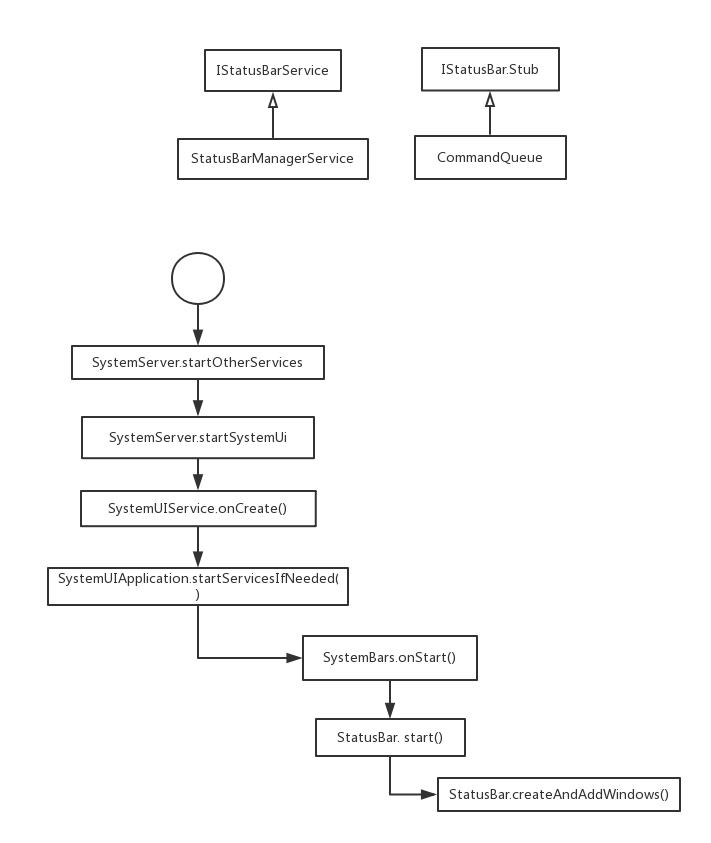

在Android系统中SystemUI是以应用的形式运行在Android系统当中，即编译SystemUI模块会生产APK文件，源代码路径在frameworks/base/packages/SystemUI/，安装路径system/priv-app/-SystemUI。它和普通apk不同的是，它是开机启动的并且不可退出，可以把它理解为一个模块。它为系统提供了基础的显示页面，比如 屏幕顶端的状态栏，屏幕底部的导航栏，壁纸，近期使用app列表，截屏操作，电量监控等功能。<!--more-->

## 状态栏的创建
在Android开机流程的一部分，会调用到ams的systemReady()通知ams已经准备就绪。
> 以下代码基于android-26,在最新的9.0的master分支中，又有一些改动，比如 SERVICE名单被配置到xml中去了


```Java
mActivityManagerService.systemReady(() -> {
    Slog.i(TAG, "Making services ready");
    ...
    try {
        startSystemUi(context, windowManagerF);
    } catch (Throwable e) {
        reportWtf("starting System UI", e);
    }
    ...
}

static final void startSystemUi(Context context, WindowManagerService windowManager) {
    Intent intent = new Intent();
    intent.setComponent(new ComponentName("com.android.systemui",
                "com.android.systemui.SystemUIService"));
    intent.addFlags(Intent.FLAG_DEBUG_TRIAGED_MISSING);
    //Slog.d(TAG, "Starting service: " + intent);
    context.startServiceAsUser(intent, UserHandle.SYSTEM);
    windowManager.onSystemUiStarted();
}

public class SystemUIService extends Service {

    @Override
    public void onCreate() {
        super.onCreate();
        ((SystemUIApplication) getApplication()).startServicesIfNeeded();
        ...
    }
}

public void startServicesIfNeeded() {
    startServicesIfNeeded(SERVICES);
}

private final Class<?>[] SERVICES = new Class[] {
        Dependency.class,
        NotificationChannels.class,
        CommandQueue.CommandQueueStart.class,
        KeyguardViewMediator.class,
        Recents.class,
        VolumeUI.class,
        Divider.class,
        SystemBars.class,
        StorageNotification.class,
        PowerUI.class,
        RingtonePlayer.class,
        KeyboardUI.class,
        PipUI.class,
        ShortcutKeyDispatcher.class,
        VendorServices.class,
        GarbageMonitor.Service.class,
        LatencyTester.class,
        GlobalActionsComponent.class,
};

private void startServicesIfNeeded(Class<?>[] services) {
    ...
    final int N = services.length;
    for (int i = 0; i < N; i++) {
        Class<?> cl = services[i];
        if (DEBUG) Log.d(TAG, "loading: " + cl);
        try {
            Object newService = SystemUIFactory.getInstance().createInstance(cl);
            mServices[i] = (SystemUI) ((newService == null) ? cl.newInstance() : newService);
        } catch (IllegalAccessException ex) {
            throw new RuntimeException(ex);
        } catch (InstantiationException ex) {
            throw new RuntimeException(ex);
        }

        mServices[i].mContext = this;
        mServices[i].mComponents = mComponents;
        if (DEBUG) Log.d(TAG, "running: " + mServices[i]);
        mServices[i].start();

        if (mBootCompleted) {
            mServices[i].onBootCompleted();
        }
    }
}

public class SystemBars extends SystemUI {
    // in-process fallback implementation, per the product config
    private SystemUI mStatusBar;

    @Override
    public void start() {
        createStatusBarFromConfig();
    }

    private void createStatusBarFromConfig() {
        if (DEBUG) Log.d(TAG, "createStatusBarFromConfig");
        // R.string.config_statusBarComponent 的值是 com.android.systemui.statusbar.phone.StatusBar
        final String clsName = mContext.getString(R.string.config_statusBarComponent);
        if (clsName == null || clsName.length() == 0) {
            throw andLog("No status bar component configured", null);
        }
        Class<?> cls = null;
        try {
            cls = mContext.getClassLoader().loadClass(clsName);
        } catch (Throwable t) {
            throw andLog("Error loading status bar component: " + clsName, t);
        }
        try {
            mStatusBar = (SystemUI) cls.newInstance();
        } catch (Throwable t) {
            throw andLog("Error creating status bar component: " + clsName, t);
        }
        mStatusBar.mContext = mContext;
        mStatusBar.mComponents = mComponents;
        mStatusBar.start();
        if (DEBUG) Log.d(TAG, "started " + mStatusBar.getClass().getSimpleName());
    }
}

public class StatusBar extends SystemUI implements ...{
    public void start() {
        ...
        mWindowManager = (WindowManager)mContext.getSystemService(Context.WINDOW_SERVICE);
        mWindowManagerService = WindowManagerGlobal.getWindowManagerService();
        mBarService = IStatusBarService.Stub.asInterface(
                ServiceManager.getService(Context.STATUS_BAR_SERVICE));
        mCommandQueue = getComponent(CommandQueue.class);
        createAndAddWindows();
        mBarService.registerStatusBar(mCommandQueue,...);
        mCommandQueue.addCallbacks(this);
        ...
    }

    public void createAndAddWindows() {
        addStatusBarWindow();
    }

    private void addStatusBarWindow() {
        makeStatusBarView();
        mStatusBarWindowManager = Dependency.get(StatusBarWindowManager.class);
        mRemoteInputController = new RemoteInputController(mHeadsUpManager);
        mStatusBarWindowManager.add(mStatusBarWindow, getStatusBarHeight());
    }

    protected void makeStatusBarView() {
        ...
        boolean showNav = mWindowManagerService.hasNavigationBar();
        if (DEBUG) Log.v(TAG, "hasNavigationBar=" + showNav);
        if (showNav) {
            createNavigationBar();
        }
        ...
    }

    public int getStatusBarHeight() {
        if (mNaturalBarHeight < 0) {
            final Resources res = mContext.getResources();
            //其中 R.dimen.status_bar_height 的值为 24dp
            mNaturalBarHeight =res.getDimensionPixelSize(com.android.internal.R.dimen.status_bar_height);
        }
        return mNaturalBarHeight;
    }
}

```
上面的过程简化成图就是这样：


值得提到的是，`SERVICES`里面的那些类，并不是真的Service,它们只是继承了 SystemUI 这个虚基类实现了 onstart()方法而已，可以理解为类似于WindowManager的一个本地服务类(仅仅是为了与wms,ams这些系统服务区分开来)，最后在`addStatusBarWindow()`方法里面创建了window并且把view添加上去完成了状态栏的创建。

在 StatusBar 的 启动过程中，会把 CommandQueue 对象传给 StatusBarManagerService ，因此当客户端通过 ServiceManager 拿到 StatusBarManagerService 的接口，就可以通过 StatusBarManagerService 的中的 CommandQueue的binder接口 来调用 CommandQueue 的方法，而 CommandQueue 则通过callback回调消息给 StatusBar ，这样子就可以更新状态栏了。
