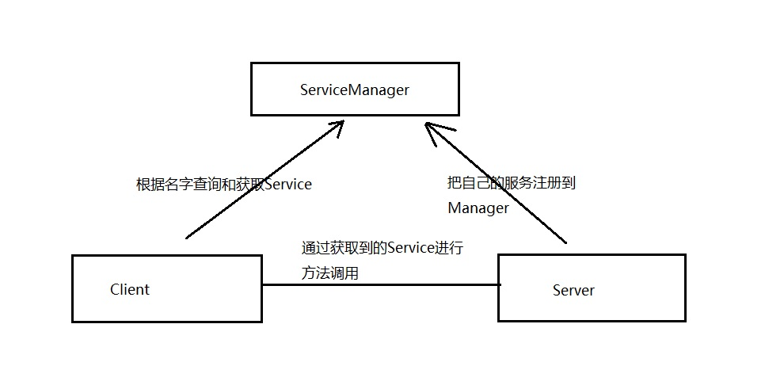
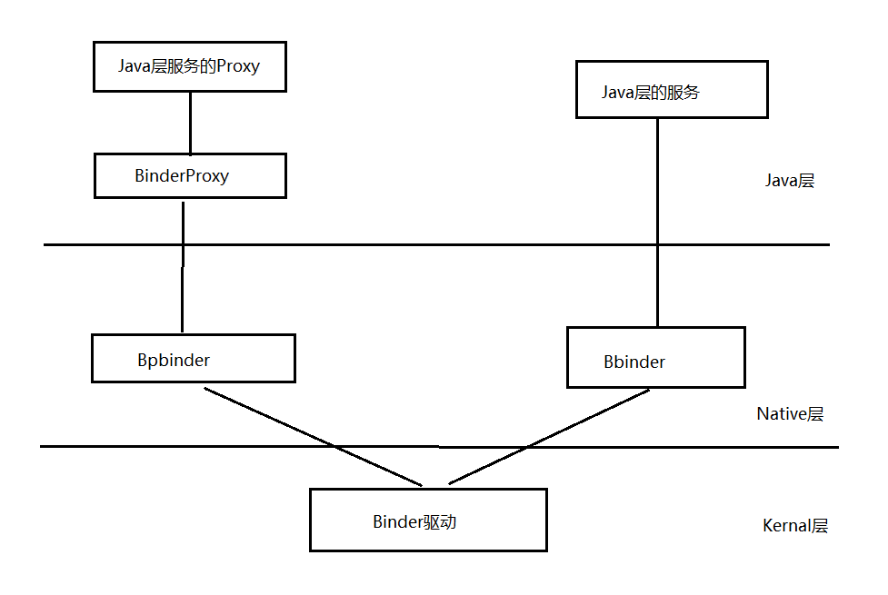
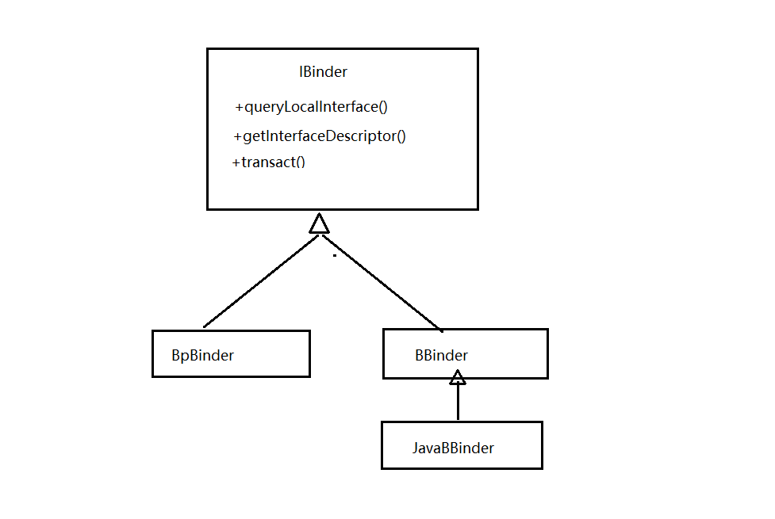

Binder是Android系统提供的一种IPC机制。在基于Binder通信的CS建构体系中，还有一个全局的ServiceManager端，它的作用是管理系统的各种Service，<!--more-->它们之间的关系如下：




整个Binder的流程：



## Native层添加Service的过程 ：
以MediaServer为例：

```c
sp<ProcessState> proc(ProcessState::self()) // 1.获取一个ProcessState的单例实例
sp<IServiceManager> sm = defaultServiceManager() //2.获取一个ServiceManager的接口
...
...//3.一些初始化操作

ProcessState::self()->startThreadPool();  //4
IPCThreadState::self()->joinThreadPool();  //5

```

1. 在第一步中，主要是在构造函数中，`open("/dev/binder")`设备，然后通过ioctl设置一些属性，最后通过mmap映射一段内存来接收数据
2. 在第二步中，通过   
`ProcessState::getContextObject(NULL)`   
依次调用new 出一个 BpBinder(0),BpBinder是用于客户端通信的IBinder接口的实现之一，每一个BpBinder都会指定一个 BBinder 来对应，BBinder则是代表服务端的IBinder接口的实现之一。这里通过0表示对应通信的服务端是ServiceManager。它们之间的关系如图：

拿到BpBinder调用interface_cast宏，得到一个指针:    
`sp<IServiceManager> sm = new BpServiceManager(BpBinder(0))`   
3. 关于BpServiceManager：   

可以看到 BpServiceManager 是 IServiceManager 的一个实现，通过上面这一系列的流程，我们拿到了 ServiceManager 的接口类指针。接下来就可以通过这个指针`addService()`添加服务到 ServiceManager了
```c
BpServiceManager::addService  --->    
remote()-->transact() -->   
IPCThreadState::self()->transact() --->    
IPCThreadState::writeTransactionData()  -->   
IPCThreadState::waitForResponse()  --->     
IPCThreadState::talkWithDriver()  --->    //ioctl,mDriverFD,BR_REPLY命令的时候直接goto finish,不会执行executeCommand()了
//到这里，写入数据到binder缓存唤醒ServiceManager，ServiceManager开始调用svcmgr_handler来注册Service。

```
4. 本线程进入休眠状态，接下来是启动消息循环线程，join进来，用来处理客户端向本服务发起的binder调用
``` c
ProcessState::self()->startThreadPool()  --->   
IPCThreadState::talkWithDriver()  --->   
IPCThreadState::executeCommand()  --->   
sp<BBinder>->transact()   --->   
sp<BBinder>.onTransact()   --->   
env->CallBooleanMethod()反射调用回到Java端execTransact()方法  --->   
Java端Service的onTransact()方法  --->   
Java端Service的Stub子类的具体实现
```

## Java层
以ServiceManager.java 为例 :

```Java
 private static IServiceManager getIServiceManager() {
        if (sServiceManager != null) {
            return sServiceManager;
        }

        // Find the service manager
        sServiceManager = ServiceManagerNative
                .asInterface(Binder.allowBlocking(BinderInternal.getContextObject()));
        return sServiceManager;
    }
```
ServiceManager通过getIServiceManager()持有IServiceManager接口的引用，`BinderInternal.getContextObject()`是一个native方法，在c++层调用`ProcessState::getContextObject(NULL)`得到一个c++的BpBinder(0)对象，并且通过jni的反射把它包装为一个BinderProxy的java对象返回给java，最后通过
```Java
	static public IServiceManager asInterface(IBinder obj)
	{
		if (obj == null) {
			return null;
		}
		IServiceManager in =
			(IServiceManager)obj.queryLocalInterface(descriptor);
		if (in != null) {
			return in;
		}
 
		return new ServiceManagerProxy(obj);
	}
```
得到一个Java层的IServiceManager的实例, 这个实例实际上是实现了同样接口的一个ServiceManagerProxy代理类，当我们调用它的方法(比如addService)，会执行到代理类的addService，然后执行代理类的mRemote.transact()方法，而这个mRemote则对应于c++底层的BpBinder(handle)，进而依次调用到c++底层的IPCThreadState类的相关方法，通过Binder驱动调起 相应的服务端 BBinder的transact()方法，后面通过env->CallBooleanMethod()反射回到Java端IServiceManager.Stub子类(这个例子里面没有找到IServiceManager.Stub子类，可能原因是不需要Java端实现，可以参考ActivityManagerService)，进而调其Stub子类中的addService()方法。

## ServiceManager启动过程
这里基于 8.1.0   
目录: `/frameworks/native/cmds/servicemanager/service_manager.c`
```c
int main(int argc, char** argv)
{
    struct binder_state *bs;
    union selinux_callback cb;
    char *driver;

    if (argc > 1) {
        driver = argv[1];
    } else {
        driver = "/dev/binder";
    }

    bs = binder_open(driver, 128*1024);
    if (!bs) {
#ifdef VENDORSERVICEMANAGER
        ALOGW("failed to open binder driver %s\n", driver);
        while (true) {
            sleep(UINT_MAX);
        }
#else
        ALOGE("failed to open binder driver %s\n", driver);
#endif
        return -1;
    }

    if (binder_become_context_manager(bs)) {
        ALOGE("cannot become context manager (%s)\n", strerror(errno));
        return -1;
    }

    cb.func_audit = audit_callback;
    selinux_set_callback(SELINUX_CB_AUDIT, cb);
    cb.func_log = selinux_log_callback;
    selinux_set_callback(SELINUX_CB_LOG, cb);

#ifdef VENDORSERVICEMANAGER
    sehandle = selinux_android_vendor_service_context_handle();
#else
    sehandle = selinux_android_service_context_handle();
#endif
    selinux_status_open(true);

    if (sehandle == NULL) {
        ALOGE("SELinux: Failed to acquire sehandle. Aborting.\n");
        abort();
    }

    if (getcon(&service_manager_context) != 0) {
        ALOGE("SELinux: Failed to acquire service_manager context. Aborting.\n");
        abort();
    }


    binder_loop(bs, svcmgr_handler);

    return 0;
}


```

1. 打开/dev/binder文件：`open("/dev/binder", O_RDWR)`;
2. 建立128K内存映射：`mmap(NULL, mapsize, PROT_READ, MAP_PRIVATE, bs->fd, 0)`:     
这里为什么会同时使用进程虚拟地址空间和内核虚拟地址空间来映射同一个物理页面呢？这就是Binder进程间通信机制的精髓所在了，同一个物理页面，一方映射到进程虚拟地址空间，一方面映射到内核虚拟地址空间，这样，进程和内核之间就可以减少一次内存拷贝了，提到了进程间通信效率。举个例子如，Client要将一块内存数据传递给Server，一般的做法是，Client将这块数据从它的进程空间拷贝到内核空间中，然后内核再将这个数据从内核空间拷贝到Server的进程空间，这样，Server就可以访问这个数据了。但是在这种方法中，执行了两次内存拷贝操作，而采用我们上面提到的方法，只需要把Client进程空间的数据拷贝一次到内核空间，然后Server与内核共享这个数据就可以了，整个过程只需要执行一次内存拷贝，提高了效率。
3. 通知Binder驱动程序它是守护进程：`binder_become_context_manager(bs)`:   
初始化binder_context_mgr_uid为current->cred->euid，这样使当前线程成为Binder机制的守护进程，并且通过binder_new_node为Service Manager创建Binder实体，并且把它的指针保存在binder_context_mgr_node中
4. 进入循环等待请求的到来：`binder_loop(bs, svcmgr_handler)`:  
在`binder_ioctl()`中通过`wait_event_interruptible_exclusive()`阻塞


> 参考：   
> 《深入理解Android 卷1》  
> 《深入理解Android 卷3》   
>  [Android进程间通信（IPC）机制Binder简要介绍和学习计划](https://blog.csdn.net/luoshengyang/article/details/6618363)