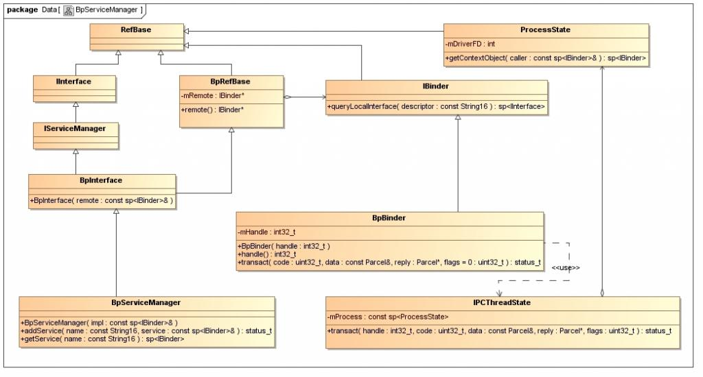
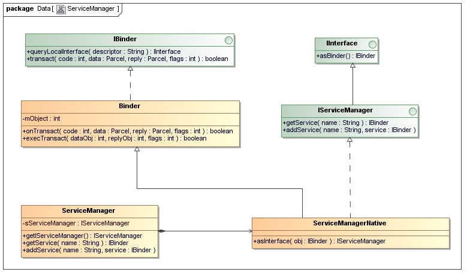

Binder是Android系统提供的一种IPC机制。在基于Binder通信的CS建构体系中，还有一个全局的ServiceManager端，它的作用是管理系统的各种Service，<!--more-->它们之间的关系如下：


整个Binder的流程：


因为按照自己的逻辑写总是很乱，所以写到最后发现基本就是对 [Android进程间通信（IPC）机制Binder简要介绍和学习计划](https://blog.csdn.net/luoshengyang/article/details/6618363)的简化。。。


## Native端 ServiceManager 启动过程

这里基于 8.1.0   
目录: `/frameworks/native/cmds/servicemanager/service_manager.c`
```c
int main(int argc, char** argv)
{
    struct binder_state *bs;
    union selinux_callback cb;
    char *driver;

    if (argc > 1) {
        driver = argv[1];
    } else {
        driver = "/dev/binder";
    }

    bs = binder_open(driver, 128*1024);
    if (!bs) {
#ifdef VENDORSERVICEMANAGER
        ALOGW("failed to open binder driver %s\n", driver);
        while (true) {
            sleep(UINT_MAX);
        }
#else
        ALOGE("failed to open binder driver %s\n", driver);
#endif
        return -1;
    }

    if (binder_become_context_manager(bs)) {
        ALOGE("cannot become context manager (%s)\n", strerror(errno));
        return -1;
    }

    cb.func_audit = audit_callback;
    selinux_set_callback(SELINUX_CB_AUDIT, cb);
    cb.func_log = selinux_log_callback;
    selinux_set_callback(SELINUX_CB_LOG, cb);

#ifdef VENDORSERVICEMANAGER
    sehandle = selinux_android_vendor_service_context_handle();
#else
    sehandle = selinux_android_service_context_handle();
#endif
    selinux_status_open(true);

    if (sehandle == NULL) {
        ALOGE("SELinux: Failed to acquire sehandle. Aborting.\n");
        abort();
    }

    if (getcon(&service_manager_context) != 0) {
        ALOGE("SELinux: Failed to acquire service_manager context. Aborting.\n");
        abort();
    }


    binder_loop(bs, svcmgr_handler);

    return 0;
}

void binder_loop(struct binder_state *bs, binder_handler func)
    {
        int res;
        struct binder_write_read bwr;
        unsigned readbuf[32];
    
        bwr.write_size = 0;
        bwr.write_consumed = 0;
        bwr.write_buffer = 0;
        
        readbuf[0] = BC_ENTER_LOOPER;
        binder_write(bs, readbuf, sizeof(unsigned));
    
        for (;;) {
            bwr.read_size = sizeof(readbuf);
            bwr.read_consumed = 0;
            bwr.read_buffer = (unsigned) readbuf;
    
            res = ioctl(bs->fd, BINDER_WRITE_READ, &bwr);
    
            if (res < 0) {
                LOGE("binder_loop: ioctl failed (%s)\n", strerror(errno));
                break;
            }
    
            res = binder_parse(bs, 0, readbuf, bwr.read_consumed, func);
            if (res == 0) {
                LOGE("binder_loop: unexpected reply?!\n");
                break;
            }
            if (res < 0) {
                LOGE("binder_loop: io error %d %s\n", res, strerror(errno));
                break;
            }
        }
    }
    ```
```


提炼出关键步骤就是
1. `binder_open(driver, 128*1024)` ,内部调用为 :
    1. 打开/dev/binder文件：`bs->fd = open("/dev/binder", O_RDWR);`,这个方法会进入到binder驱动程序，保存线程上下文信息，生成多个红黑树，用于保存服务端binder实体信息，客户端binder引用信息等;
    2. 记下映射内存大小:`bs->mapsize = mapsize;`
    3. 建立128K内存映射:`bs->mapped = mmap(NULL, mapsize, PROT_READ, MAP_PRIVATE, bs->fd, 0);`,这个方法也会进入到binder驱动程序,使用进程虚拟地址空间和内核虚拟地址空间来映射同一个物理页面。这样，进程和内核之间就可以减少一次内存拷贝了，提到了进程间通信效率。举个例子如，Client要将一块内存数据传递给Server，一般的做法是，Client将这块数据从它的进程空间拷贝到内核空间中，然后内核再将这个数据从内核空间拷贝到Server的进程空间，这样，Server就可以访问这个数据了。但是在这种方法中，执行了两次内存拷贝操作，而采用我们上面提到的方法，只需要把Client进程空间的数据拷贝一次到内核空间，然后Server与内核共享这个数据就可以了，整个过程只需要执行一次内存拷贝，提高了效率。

    这里用到一个数据结构 binder_state 把它们存起来
    ```c
    struct binder_state
    {
        int fd;  //驱动的文件描述符
        void *mapped;  //映射内存的起始地址
        unsigned mapsize;  //映射内存的大小
    };
    ```
2. 通知Binder驱动程序它是守护进程：
    ```c
    int binder_become_context_manager(struct binder_state *bs)
    {
        return ioctl(bs->fd, BINDER_SET_CONTEXT_MGR, 0);
    }
    ```
    这里通过调用ioctl文件操作函数来通知Binder驱动程序自己是守护进程，cmd是BINDER_SET_CONTEXT_MGR，没有参数。在驱动程序内部的调用为:

    1. 初始化`binder_context_mgr_uid`为`current->cred->euid`，`binder_context_mgr_uid`表示Service Manager守护进程的uid,这样使当前线程成为Binder机制的守护进程
    2. 通过`binder_new_node()`来创建binder实体,`binder_context_mgr_node`用来表示Service Manager的binder实体

3. 进入循环等待请求的到来：`binder_loop(bs, svcmgr_handler)`,并且使用 `svcmgr_handler` 函数来处理binder请求,没有请求时， 
在`binder_ioctl()`函数中通过`wait_event_interruptible_exclusive()`阻塞


## Native端获取 ServiceManager 远程接口的过程

Service Manager在Binder机制中既充当守护进程的角色，同时它也充当着Server角色，然而它又与一般的Server不一样。

对于普通的Server来说，Client如果想要获得Server的远程接口，那么必须通过Service Manager远程接口提供的getService接口来获得，getService是一个使用Binder机制来进行进程间通信的过程(需要通过名字查询得到相应的Server端binder实体对应的binder引用句柄，用于生成BpBinder)；

而对于Service Manager这个Server来说，Client如果想要获得Service Manager远程接口，却不必通过进程间通信机制来获得，因为Service Manager远程接口是一个特殊的Binder引用，它的引用句柄一定是0。

获取Service Manager远程接口的函数是
```c++
sp<IServiceManager> defaultServiceManager()
{
 
    if (gDefaultServiceManager != NULL) return gDefaultServiceManager;
 
    {
        AutoMutex _l(gDefaultServiceManagerLock);
        if (gDefaultServiceManager == NULL) {
            gDefaultServiceManager = interface_cast<IServiceManager>(
                ProcessState::self()->getContextObject(NULL));
        }
    }
 
    return gDefaultServiceManager;
}
```
一个相关的类图:

从图中可以看到：
1. BpServiceManager类继承了BpInterface<IServiceManager>类，BpInterface是个模板类，又继承了IServiceManager和BpRefBase,它的构造函数需要一个IBinder类
    ```c++
    template<typename INTERFACE>
    class BpInterface : public INTERFACE, public BpRefBase
    {
    public:
        BpInterface(const sp<IBinder>& remote);
    
    protected:
        virtual IBinder* onAsBinder();
    };
    ```
2. IServiceManager类继承了IInterface类，而IInterface类和BpRefBase类又继承了RefBase类。在BpRefBase类中，有一个成员变量mRemote，它的类型是IBinder*，实现类为BpBinder，它表示一个Binder引用，引用句柄值保存在BpBinder类的mHandle成员变量中。

创建Service Manager远程接口主要是下面语句,主要是三个步骤:
```c++
gDefaultServiceManager = interface_cast<IServiceManager>(ProcessState::self()->getContextObject(NULL));
```
1. 首先是`ProcessState::self()`:
    ```c++
        sp<ProcessState> ProcessState::self()
        {
            if (gProcess != NULL) return gProcess;
            
            AutoMutex _l(gProcessMutex);
            if (gProcess == NULL) gProcess = new ProcessState;
            return gProcess;
        }
    ```
    这里仅仅是创建一个单例，它的构造函数
    ```c++
    ProcessState::ProcessState()
    : mDriverFD(open_driver())
    , mVMStart(MAP_FAILED)
    , mManagesContexts(false)
    , mBinderContextCheckFunc(NULL)
    , mBinderContextUserData(NULL)
    , mThreadPoolStarted(false)
    , mThreadPoolSeq(1)
    {
        if (mDriverFD >= 0) {
            // XXX Ideally, there should be a specific define for whether we
            // have mmap (or whether we could possibly have the kernel module
            // availabla).
    #if !defined(HAVE_WIN32_IPC)
            // mmap the binder, providing a chunk of virtual address space to receive transactions.
            mVMStart = mmap(0, BINDER_VM_SIZE, PROT_READ, MAP_PRIVATE | MAP_NORESERVE, mDriverFD, 0);
            if (mVMStart == MAP_FAILED) {
                // *sigh*
                LOGE("Using /dev/binder failed: unable to mmap transaction memory.\n");
                close(mDriverFD);
                mDriverFD = -1;
            }
    #else
            mDriverFD = -1;
    #endif
        }
        if (mDriverFD < 0) {
            // Need to run without the driver, starting our own thread pool.
        }
    }
    ```
    在构造函数里面做了两件事，一是通过open_driver函数打开Binder设备文件/dev/binder，并将打开设备文件描述符保存在成员变量mDriverFD中；二是通过mmap来把设备文件/dev/binder映射到内存中
2. `ProcessState::self()->getContextObject(NULL)`,这个函数的返回值，是一个句柄值为0的Binder引用，即BpBinder:`new BpBinder(0)`
3. `interface_cast<IServiceManager>()`函数,这是一个模板函数，最终调用到了`IServiceManager::asInterface()`:
    ```c++
    android::sp<IServiceManager> IServiceManager::asInterface(const android::sp<android::IBinder>& obj)                                              
    {                                                                                     
        android::sp<IServiceManager> intr;                                                    
        
        if (obj != NULL) {                                                                     
            intr = static_cast<IServiceManager*>(                                                  
                        obj->queryLocalInterface(IServiceManager::descriptor).get());
            
            if (intr == NULL) {                
                intr = new BpServiceManager(obj);                                        
            }                                          
        ｝
        return intr;                                  
    }   
    ```
因此实际的过程为:
```c++
gDefaultServiceManager = new BpServiceManager(new BpBinder(0));
```
即获取的Service Manager远程接口，本质上是一个BpServiceManager，包含了一个句柄值为0的Binder引用，这个过程不涉及到跨进程调用

## Native端普通 Service 的初始化，注册，启动
在上一节里面我们看到了 ServiceManager 的远程接口端的类图，实际上是一个BpServiceManager。这里我们以MediaPlayerService为例，看一下服务端的类图

可以看到，这个结构和Bp端很类似，不同的地方在于，`MediaPlayerService`继承于`BnMediaPlayerService`,而`BnMediaPlayerService`继承于`BnInterface`，这里是`BnInterface`而不是`BpInterface`接口， IBinder 的实现类则是`BBinder`其他部分则是类似的
```c++
template<typename INTERFACE>
class BnInterface : public INTERFACE, public BBinder
{
public:
    virtual sp<IInterface>      queryLocalInterface(const String16& _descriptor);
    virtual const String16&     getInterfaceDescriptor() const;
 
protected:
    virtual IBinder*            onAsBinder();
};
```
MediaPlayerService的启动过程：
```c++
    int main(int argc, char** argv)
    {
        sp<ProcessState> proc(ProcessState::self());
        sp<IServiceManager> sm = defaultServiceManager();
        LOGI("ServiceManager: %p", sm.get());
        AudioFlinger::instantiate();
        MediaPlayerService::instantiate();
        CameraService::instantiate();
        AudioPolicyService::instantiate();
        ProcessState::self()->startThreadPool();
        IPCThreadState::self()->joinThreadPool();
    }
```
主要步骤是：
1. `sp<ProcessState> proc(ProcessState::self());` , 在上一节已经分析过这句过程。主要是打开binder设备和映射内存
2. `sp<IServiceManager> sm = defaultServiceManager()`,获取ServiceManager接口，上一节也已经分析过
3. `MediaPlayerService::instantiate()`：
    ```c++
    void MediaPlayerService::instantiate() {
    defaultServiceManager()->addService(
            String16("media.player"), new MediaPlayerService());
    }
    ```
    addService函数传入了两个参数，一个是服务的名字，一个是服务的实现类。这里首先看一下`defaultServiceManager`返回的`BpServiceManager`定义:
    ```c++
    class BpServiceManager : public BpInterface<IServiceManager>
    {
    public:
    	BpServiceManager(const sp<IBinder>& impl)
    		: BpInterface<IServiceManager>(impl)
    	{
    	}
     
    	......
     
    	virtual status_t addService(const String16& name, const sp<IBinder>& service)
    	{
    		Parcel data, reply;
            //IServiceManager::getInterfaceDescriptor()返回来的是一个字符串，即"android.os.IServiceManager"，写入一个字符串
    		data.writeInterfaceToken(IServiceManager::getInterfaceDescriptor());
            // name 即 "media.player"，写入一个字符串
    		data.writeString16(name);
    		data.writeStrongBinder(service);
    		status_t err = remote()->transact(ADD_SERVICE_TRANSACTION, data, &reply);
    		return err == NO_ERROR ? reply.readExceptionCode() 
    	}
    	......
     
    };

    status_t Parcel::writeStrongBinder(const sp<IBinder>& val)
    {
        return flatten_binder(ProcessState::self(), val, this);
    }
    ```
    这里 `flatten_binder(ProcessState::self(), val, this)`会把传入进来的 IBinder实现类service转成一个flat_binder_object对象，然后序列化到Parcel 里面 。 每一个Binder实体或者引用，通过 struct flat_binder_object 来表示，成员变量里面 binder表示这是一个Binder实体，handle表示这是一个Binder引用，当这是一个Binder实体时，cookie才有意义，表示附加数据，由进程自己解释。：
    ```c++
    status_t flatten_binder(const sp<ProcessState>& proc,const sp<IBinder>& binder, Parcel* out)
    {
        flat_binder_object obj;
        
        obj.flags = 0x7f | FLAT_BINDER_FLAG_ACCEPTS_FDS;
        if (binder != NULL) {
            IBinder *local = binder->localBinder();
            if (!local) {
                BpBinder *proxy = binder->remoteBinder();
                if (proxy == NULL) {
                    LOGE("null proxy");
                }
                const int32_t handle = proxy ? proxy->handle() : 0;
                obj.type = BINDER_TYPE_HANDLE;
                obj.handle = handle;
                obj.cookie = NULL;
            } else {
                obj.type = BINDER_TYPE_BINDER;
                obj.binder = local->getWeakRefs();
                obj.cookie = local;
            }
        } else {
            obj.type = BINDER_TYPE_BINDER;
            obj.binder = NULL;
            obj.cookie = NULL;
        }
        
        return finish_flatten_binder(binder, obj, out); //序列化
    }
    ```
    序列化完data后，就开始调用`status_t err = remote()->transact(ADD_SERVICE_TRANSACTION, data, &reply);`,这里的remote成员函数来自于BpRefBase类，它返回一个BpBinder指针。后面是一连串的调用链：
    
    ```c++
    status_t BpBinder::transact(uint32_t code, const Parcel& data, Parcel* reply, uint32_t flags)
    {
        ...
        //因为这是在 BpServiceManager 内，所以 mHandle 值是0
        status_t status = IPCThreadState::self()->transact(mHandle, code, data, reply, flags);
        ...
    }

    status_t IPCThreadState::transact(int32_t handle,
                                    uint32_t code, const Parcel& data,
                                    Parcel* reply, uint32_t flags)
    {
        . . . . . .
            // 把data数据整理进内部的mOut包中
            err = writeTransactionData(BC_TRANSACTION, flags, handle, code, data, NULL);
        . . . . . .
    //IPCThreadState::transact()会考虑本次发起的事务是否需要回复。“不需要等待回复的”事务，在其flag标志中会含有TF_ONE_WAY，表示一去不回头。而“需要等待回复的”，则需要在传递时提供记录回复信息的Parcel对象，一般发起transact()的用户会提供这个Parcel对象，如果不提供，transact()函数内部会临时构造一个假的Parcel对象。
        if ((flags & TF_ONE_WAY) == 0)
        {
            . . . . . .
            if (reply)
            {
                err = waitForResponse(reply);
            }
            else
            {
                Parcel fakeReply;
                err = waitForResponse(&fakeReply);
            }
            . . . . . .
        }
        else
        {
            err = waitForResponse(NULL, NULL);
        }
    
        return err;
    }

    status_t IPCThreadState::writeTransactionData(int32_t cmd, uint32_t binderFlags,int32_t handle, uint32_t code, const Parcel& data, status_t* statusBuffer)
    {
        //把数据封装成 binder_transaction_data
        binder_transaction_data tr;
        tr.target.handle = handle;
        tr.code = code;
        tr.flags = binderFlags;
        const status_t err = data.errorCheck();
        if (err == NO_ERROR) {
            tr.data_size = data.ipcDataSize();
            tr.data.ptr.buffer = data.ipcData();
            tr.offsets_size = data.ipcObjectsCount()*sizeof(size_t);
            tr.data.ptr.offsets = data.ipcObjects();
        }
        ....
        // 写到mOut中，mOut是命令的缓冲区，也是一个Parcel
        mOut.writeInt32(cmd);
        mOut.write(&tr, sizeof(tr));
    }

    status_t IPCThreadState::waitForResponse(Parcel *reply, status_t *acquireResult)
    {
        ...
        // talkWithDriver()内部会完成跨进程事务
        if ((err=talkWithDriver()) < NO_ERROR) break;
        ...
        // 事务的回复信息被记录在mIn中，所以需要进一步分析这个回
        cmd = mIn.readInt32();
        switch (cmd) {
        case BR_TRANSACTION_COMPLETE:
            if (!reply && !acquireResult) goto finish;
            break;
        ...
    }

    status_t IPCThreadState::talkWithDriver(bool doReceive)
    {
        //把mOut数据和mIn的数据处理后构造一个binder_write_read对象
        binder_write_read bwr;
        bwr.write_size = outAvail;
        bwr.write_buffer = (long unsigned int)mOut.data();
        // This is what we'll read.
        if (doReceive && needRead) {
            bwr.read_size = mIn.dataCapacity();
            bwr.read_buffer = (long unsigned int)mIn.data();
        } else {
            bwr.read_size = 0;
        }
        ...
        if (ioctl(mProcess->mDriverFD, BINDER_WRITE_READ, &bwr) >= 0)

        // 这里设置收到的回复数据
        if (bwr.read_consumed > 0) {
            mIn.setDataSize(bwr.read_consumed);
            mIn.setDataPosition(0);
        }
        ...
    }
    ```
    
    短暂的总结一下流程:
    

    --------

    > 此处开始是 binder驱动内容，其实只需要知道这个`talkWithDriver()`结果是 mIn 得到数据，`waitForResponse()`中`reply->ipcSetDataReferenc()`设置返回数据即可。并且这里的`talkWithDriver()`中会唤醒ServiceManager

    ```c++
    //内核驱动程序，
    static long binder_ioctl(struct file *filp, unsigned int cmd, unsigned long arg)
    {
        ...
        switch (cmd) {
        case BINDER_WRITE_READ: {
            ...
            if (bwr.write_size > 0) {
                ret = binder_thread_write(proc, thread, (void __user *)bwr.write_buffer, bwr.write_size, &bwr.write_consumed);
                ...
            }
            if (bwr.read_size > 0) {
                ret = binder_thread_read(proc, thread, (void __user *)bwr.read_buffer, bwr.read_size, &bwr.read_consumed, filp->f_flags & O_NONBLOCK);
                ...
            }
            ...
            break;
        }
        ......
    }

    binder_thread_write(struct binder_proc *proc, struct binder_thread *thread,void __user *buffer, int size, signed long *consumed)
    {
        ...
        case BC_REPLY:
            struct binder_transaction_data tr;
            if (copy_from_user(&tr, ptr, sizeof(tr)))
                return -EFAULT;
            ptr += sizeof(tr);
            binder_transaction(proc, thread, &tr, cmd == BC_REPLY);
        ...
    }

    static void binder_transaction(struct binder_proc *proc, struct binder_thread *thread,struct binder_transaction_data *tr, int reply)
    {
        ......
        //根据handle找到node,这里handle是0，因此找到binder_context_mgr_node
        if (tr->target.handle) {
            ......
		} else {
    	    target_node = binder_context_mgr_node;
        }
        target_proc = target_node->proc;
        target_list = &target_proc->todo;
        target_wait = &target_proc->wait; 
    	......
        // 为这个Bn端Binder新建一个node
        struct binder_node *node = binder_get_node(proc, fp->binder);
        if (node == NULL) {
            node = binder_new_node(proc, fp->binder, fp->cookie);
            if (node == NULL) {
                return_error = BR_FAILED_REPLY;
                goto err_binder_new_node_failed;
            }
            ...
        }
        ...

        // 封装一个事务，并唤醒 ServiceManager去处理
    	t->work.type = BINDER_WORK_TRANSACTION;
        list_add_tail(&t->work.entry, target_list);
        tcomplete->type = BINDER_WORK_TRANSACTION_COMPLETE;
        list_add_tail(&tcomplete->entry, &thread->todo);
        
    	if (target_wait)
    		wake_up_interruptible(target_wait);
        ......
    }

    // 第一次执行完这个函数后会返回到waitForResponse继续执行，在waitForResponse中再循环一次才跳出waitForResponse中的while循环，第二次执行到这里的时候 MediaPlayerService 会休眠
    //而对 BR_TRANSACTION_COMPLETE 的处理，就分情况了，如果这个请求是异步的，那个整个BC_TRANSACTION操作就完成了，如果这个请求是同步的，即要等待回复的，也就是reply不为空，那么还要继续通过IPCThreadState::talkWithDriver进入到Binder驱动程序中去等待BC_TRANSACTION操作的处理结果。
    static int binder_thread_read(struct binder_proc *proc, struct binder_thread *thread,void  __user *buffer, int size, signed long *consumed, int non_block)
    {
        ...
        if (put_user(BR_NOOP, (uint32_t __user *)ptr)) 
        ...
        if (wait_for_proc_work) {
		    .......
        } else {
            if (non_block) {
                if (!binder_has_thread_work(thread))
                    ret = -EAGAIN;
            } else
                ret = wait_event_interruptible(thread->wait, binder_has_thread_work(thread));
        }
        ...
        while (1) {
            switch (w->type) {
                case BINDER_WORK_TRANSACTION_COMPLETE: {
                    cmd = BR_TRANSACTION_COMPLETE;
                    if (put_user(cmd, (uint32_t __user *)ptr))
                    ...
                }
            }
        }
        ...
    }
    ```

    --------

    ### 唤醒 ServiceManager后的动作

    ServiceManager 在`binder_loop`的`ioctl()`函数中由于`binder_thread_read()`的`wait_event_interruptible_exclusive()`而进入阻塞状态：
    ```c++
    void binder_loop(struct binder_state *bs, binder_handler func)
    {
        int res;
        struct binder_write_read bwr;
        unsigned readbuf[32];
    
        bwr.write_size = 0;
        bwr.write_consumed = 0;
        bwr.write_buffer = 0;
        
        readbuf[0] = BC_ENTER_LOOPER;
        binder_write(bs, readbuf, sizeof(unsigned));
    
        for (;;) {
            bwr.read_size = sizeof(readbuf);
            bwr.read_consumed = 0;
            bwr.read_buffer = (unsigned) readbuf;
    
            res = ioctl(bs->fd, BINDER_WRITE_READ, &bwr);
    
            if (res < 0) {
                LOGE("binder_loop: ioctl failed (%s)\n", strerror(errno));
                break;
            }
    
            res = binder_parse(bs, 0, readbuf, bwr.read_consumed, func);
            if (res == 0) {
                LOGE("binder_loop: unexpected reply?!\n");
                break;
            }
            if (res < 0) {
                LOGE("binder_loop: io error %d %s\n", res, strerror(errno));
                break;
            }
        }
    }
    ```
    被唤醒后，会在`binder_thread_read()`中读取binder传过来的数据，赋值到本地局部变量struct binder_transaction_data tr中，接着把tr的内容拷贝到用户传进来的缓冲区 ，返回后再把`binder_ioctl()`中的本地变量struct binder_write_read bwr的内容拷贝回到用户传进来的缓冲区中，最后从`binder_ioctl()`函数返回，接着执行`binder_parse()`:
    ```c++
    int binder_parse(struct binder_state *bs, struct binder_io *bio,
                    uint32_t *ptr, uint32_t size, binder_handler func)
    {
        int r = 1;
        uint32_t *end = ptr + (size / 4);
    
        while (ptr < end) {
            uint32_t cmd = *ptr++;
            ......
            case BR_TRANSACTION: {
                struct binder_txn *txn = (void *) ptr;
                if ((end - ptr) * sizeof(uint32_t) < sizeof(struct binder_txn)) {
                    LOGE("parse: txn too small!\n");
                    return -1;
                }
                binder_dump_txn(txn);
                if (func) {
                    unsigned rdata[256/4];
                    struct binder_io msg;
                    struct binder_io reply;
                    int res;
    
                    bio_init(&reply, rdata, sizeof(rdata), 4);
                    bio_init_from_txn(&msg, txn);
                    res = func(bs, txn, &msg, &reply);
                    binder_send_reply(bs, &reply, txn->data, res); 
                }
                ptr += sizeof(*txn) / sizeof(uint32_t);
                break;
                                }
            ......
            default:
                LOGE("parse: OOPS %d\n", cmd);
                return -1;
            }
        }
    
        return r;
    }
    ```
    这个函数传入的函数指针是`svcmgr_handler`，因此会进入到
    ```c++
    int svcmgr_handler(struct binder_state *bs,
                    struct binder_txn *txn,
                    struct binder_io *msg,
                    struct binder_io *reply)
    {
        struct svcinfo *si;
        uint16_t *s;
        unsigned len;
        void *ptr;
        uint32_t strict_policy;
    
        if (txn->target != svcmgr_handle)
            return -1;
    
        // Equivalent to Parcel::enforceInterface(), reading the RPC
        // header with the strict mode policy mask and the interface name.
        // Note that we ignore the strict_policy and don't propagate it
        // further (since we do no outbound RPCs anyway).
        strict_policy = bio_get_uint32(msg);
        s = bio_get_string16(msg, &len);  // "android.os.IServiceManager"
        if ((len != (sizeof(svcmgr_id) / 2)) ||
            memcmp(svcmgr_id, s, sizeof(svcmgr_id))) {
                fprintf(stderr,"invalid id %s\n", str8(s));
                return -1;
        }
    
        switch(txn->code) {
        ......
        case SVC_MGR_ADD_SERVICE:
            s = bio_get_string16(msg, &len);   // "media.player"
            ptr = bio_get_ref(msg);    // new MediaPlayerService()
            if (do_add_service(bs, s, len, ptr, txn->sender_euid))
                return -1;
            break;
        ......
        }
    
        bio_put_uint32(reply, 0);  //reply返回0
        return 0;

    //把MediaPlayerService这个Binder实体的句柄值写到一个struct svcinfo结构体中，
    //然后插入到链接svclist的头部去
    int do_add_service(struct binder_state *bs,
                    uint16_t *s, unsigned len,
                    void *ptr, unsigned uid)
    {
        struct svcinfo *si;
    //    LOGI("add_service('%s',%p) uid=%d\n", str8(s), ptr, uid);
    
        if (!ptr || (len == 0) || (len > 127))
            return -1;
    
        if (!svc_can_register(uid, s)) {
            LOGE("add_service('%s',%p) uid=%d - PERMISSION DENIED\n",
                str8(s), ptr, uid);
            return -1;
        }
    
        si = find_svc(s, len);  //根据名字查找引用，这里是  "media.player"
        if (si) {
            if (si->ptr) {
                LOGE("add_service('%s',%p) uid=%d - ALREADY REGISTERED\n",
                    str8(s), ptr, uid);
                return -1;
            }
            si->ptr = ptr;
        } else {
            si = malloc(sizeof(*si) + (len + 1) * sizeof(uint16_t));
            if (!si) {
                LOGE("add_service('%s',%p) uid=%d - OUT OF MEMORY\n",
                    str8(s), ptr, uid);
                return -1;
            }
            si->ptr = ptr;
            si->len = len;
            memcpy(si->name, s, (len + 1) * sizeof(uint16_t));
            si->name[len] = '\0';
            si->death.func = svcinfo_death;
            si->death.ptr = si;
            si->next = svclist;
            svclist = si;
        }
    
        binder_acquire(bs, ptr);
        binder_link_to_death(bs, ptr, &si->death);
        return 0;
    }
    ```
    最后，执行`binder_send_reply()`函数，再次进入到`ioctl()`函数中，把数据再次封装成一个事务，唤醒 MediaPlayerService去处理

    MediaPlayerService 被唤醒后调用`ioctl()`，读取 事务，从事物中 根据数据的内核地址计算出用户空间地址(Binder驱动程序和Service Manager守护进程共享了同一个物理内存的内容，拷贝的只是这个物理内存在用户空间的虚拟地址回去)，最后在`WaitForResponse()`函数中
    ```c++
        reply->ipcSetDataReference(
            reinterpret_cast<const uint8_t*>(tr.data.ptr.buffer),
            tr.data_size,
            reinterpret_cast<const size_t*>(tr.data.ptr.offsets),
            tr.offsets_size/sizeof(size_t),
            freeBuffer, this);
    ```
    设置 reply

    到这里 ， IServiceManager::addService终于执行完毕...

4. 接下来是
    ```c++
        ProcessState::self()->startThreadPool();
        IPCThreadState::self()->joinThreadPool();
    ```
    这两个步骤会各开启一个线程，都会执行joinThreadPool(),参数不一样
    ```c++
    void IPCThreadState::joinThreadPool(bool isMain)
    {
        LOG_THREADPOOL("**** THREAD %p (PID %d) IS JOINING THE THREAD POOL\n", (void*)pthread_self(), getpid());
    
        mOut.writeInt32(isMain ? BC_ENTER_LOOPER : BC_REGISTER_LOOPER);
    
        ......
    
        status_t result;
        do {
            int32_t cmd;
    
            .......
    
            // now get the next command to be processed, waiting if necessary
            result = talkWithDriver();
            if (result >= NO_ERROR) {
                size_t IN = mIn.dataAvail();
                if (IN < sizeof(int32_t)) continue;
                cmd = mIn.readInt32();
                ......
                }
    
                result = executeCommand(cmd);
            }
    
            ......
        } while (result != -ECONNREFUSED && result != -EBADF);
    
        .......
    
        mOut.writeInt32(BC_EXIT_LOOPER);
        talkWithDriver(false);
    }
    ```
    上文中的分析可以知道，`talkWithDriver()`会把数据封装成一个事务发送给服务端 ，服务端处理请求后会把数据封装成事务返回，`talkWithDriver()`则解析返回的事务得到数据并返回。因此这里返回数据后接着调用`executeCommand()`
    ```c++
    status_t IPCThreadState::executeCommand(int32_t cmd)
    {
        BBinder* obj;
        RefBase::weakref_type* refs;
        status_t result = NO_ERROR;
    
        switch (cmd) {
        ......
    
        case BR_TRANSACTION:
            {
                binder_transaction_data tr;
                result = mIn.read(&tr, sizeof(tr));
                
                ......
    
                Parcel reply;
                
                ......
    
                if (tr.target.ptr) {
                    sp<BBinder> b((BBinder*)tr.cookie);  // 这里拿到了 服务端binder
                    const status_t error = b->transact(tr.code, buffer, &reply, tr.flags);
                    if (error < NO_ERROR) reply.setError(error);
    
                } else {
                    const status_t error = the_context_object->transact(tr.code, buffer, &reply, tr.flags);
                    if (error < NO_ERROR) reply.setError(error);
                }
    
                ......
            }
            break;
    
        .......
        }
    
        if (result != NO_ERROR) {
            mLastError = result;
        }
    	return result;
    }

    status_t BBinder::transact(uint32_t code, const Parcel& data, Parcel* reply, uint32_t flags)
    {
        data.setDataPosition(0);
     
        status_t err = NO_ERROR;
        switch (code) {
            case PING_TRANSACTION:
                reply->writeInt32(pingBinder());
                break;
            default:
                err = onTransact(code, data, reply, flags);
                break;
        }
     
        if (reply != NULL) {
            reply->setDataPosition(0);
        }
     
        return err;
    }
    ```
    因为服务端继承了BBinder，因此这里实际上会调用服务端的`onTransact()`，也就是MediaPlayerService的`onTransact()`函数，执行相应的动作。这样子就从客户端跨进程调用到了服务端。

## Native端 客户端获取服务端接口的过程：
在上一节里面分析了`BpServiceManager.addService()`,这一节来看 getService() 
```c++
class BpServiceManager : public BpInterface<IServiceManager>
{
    ......
 
	virtual sp<IBinder> getService(const String16& name) const
	{
		unsigned n;
		for (n = 0; n < 5; n++){
			sp<IBinder> svc = checkService(name);
			if (svc != NULL) return svc;
			LOGI("Waiting for service %s...\n", String8(name).string());
			sleep(1);
		}
		return NULL;
	}
 
	virtual sp<IBinder> checkService( const String16& name) const
	{
		Parcel data, reply;
		data.writeInterfaceToken(IServiceManager::getInterfaceDescriptor());
		data.writeString16(name);
		remote()->transact(CHECK_SERVICE_TRANSACTION, data, &reply);
		return reply.readStrongBinder();
	}
 
	......
};
```
这里的调用链大部分都在上一节说过了。因此这里简单描述下:
```c++
remote()->transact(CHECK_SERVICE_TRANSACTION, data, &reply);

status_t BpBinder::transact(uint32_t code, const Parcel& data, Parcel* reply, uint32_t flags);

status_t IPCThreadState::transact(int32_t handle,uint32_t code, const Parcel& data,Parcel* reply, uint32_t flags)

status_t IPCThreadState::writeTransactionData(int32_t cmd, uint32_t binderFlags,int32_t handle, uint32_t code, const Parcel& data, status_t* statusBuffer)

status_t IPCThreadState::waitForResponse(Parcel *reply, status_t *acquireResult)

status_t IPCThreadState::talkWithDriver(bool doReceive)

long binder_ioctl(struct file *filp, unsigned int cmd, unsigned long arg)

int binder_thread_write(struct binder_proc *proc, struct binder_thread *thread,void __user *buffer, int size, signed long *consumed)

static void binder_transaction(struct binder_proc *proc, struct binder_thread *thread,struct binder_transaction_data *tr, int reply)

//唤醒 ServiceManager
wake_up_interruptible(target_wait);

static int binder_thread_read(struct binder_proc *proc, struct binder_thread *thread,void  __user *buffer, int size, signed long *consumed, int non_block)

IPCThreadState::talkWithDriver::ioctl(mProcess->mDriverFD, BINDER_WRITE_READ, &bwr)

//当前线程休眠，等待ServiceManager返回操作结果
ret = wait_event_interruptible(thread->wait, binder_has_thread_work(thread));

//ServiceManager 被唤醒后
static int binder_thread_read(struct binder_proc *proc, struct binder_thread *thread,void  __user *buffer, int size, signed long *consumed, int non_block)
//得到事务t
t = container_of(w, struct binder_transaction, work);

int binder_parse(struct binder_state *bs, struct binder_io *bio,uint32_t *ptr, uint32_t size, binder_handler func)

void bio_init(struct binder_io *bio, void *data,uint32_t maxdata, uint32_t maxoffs)

void bio_init_from_txn(struct binder_io *bio, struct binder_txn *txn)

int svcmgr_handler(struct binder_state *bs,struct binder_txn *txn,struct binder_io *msg,struct binder_io *reply)

void *do_find_service(struct binder_state *bs, uint16_t *s, unsigned len)

struct svcinfo *find_svc(uint16_t *s16, unsigned len)

void bio_put_ref(reply, ptr);
void bio_put_ref(struct binder_io *bio, void *ptr)
{
    struct binder_object *obj;
    
    if (ptr)
        obj = bio_alloc_obj(bio);
    else
        obj = bio_alloc(bio, sizeof(*obj));
    
    if (!obj)
        return;
    
    obj->flags = 0x7f | FLAT_BINDER_FLAG_ACCEPTS_FDS;
    obj->type = BINDER_TYPE_HANDLE;
    obj->pointer = ptr;
    obj->cookie = 0;
}

void binder_send_reply(struct binder_state *bs,struct binder_io *reply,void *buffer_to_free,int status)

int binder_write(struct binder_state *bs, void *data, unsigned len)

long binder_ioctl(struct file *filp, unsigned int cmd, unsigned long arg)

int binder_thread_write(struct binder_proc *proc, struct binder_thread *thread,void __user *buffer, int size, signed long *consumed)

static void binder_transaction(struct binder_proc *proc, struct binder_thread *thread,struct binder_transaction_data *tr, int reply)

struct binder_ref *ref = binder_get_ref(proc, fp->handle);
//旧的句柄是ServiceManager进程里面的，这里需要给它一个新的句柄值返回给客户端进程用
new_ref = binder_get_ref_for_node(target_proc, ref->node);
//清理，休眠
...

//唤醒请求的客户端线程
...

static int  
binder_thread_read(struct binder_proc *proc, struct binder_thread *thread,  void  __user *buffer, int size, signed long *consumed, int non_block) 

copy_to_user(ubuf, &bwr, sizeof(bwr))

reply->ipcSetDataReference(  reinterpret_cast<const uint8_t*>(tr.data.ptr.buffer),tr.data_size,  reinterpret_cast<const size_t*>(tr.data.ptr.offsets), tr.offsets_size/sizeof(size_t),freeBuffer, this);  

sp<IBinder> Parcel::readStrongBinder() const;

status_t unflatten_binder(const sp<ProcessState>& proc,const Parcel& in, sp<IBinder>* out);
status_t unflatten_binder(const sp<ProcessState>& proc,const Parcel& in, sp<IBinder>* out)
{
    const flat_binder_object* flat = in.readObject(false);
    
    if (flat) {
        switch (flat->type) {
            case BINDER_TYPE_BINDER:
                *out = static_cast<IBinder*>(flat->cookie);
                return finish_unflatten_binder(NULL, *flat, in);
            case BINDER_TYPE_HANDLE:
                *out = proc->getStrongProxyForHandle(flat->handle);
                return finish_unflatten_binder(
                    static_cast<BpBinder*>(out->get()), *flat, in);
        }        
    }
    return BAD_TYPE;
}
//根据句柄生成BpBinder()
sp<IBinder> ProcessState::getStrongProxyForHandle(int32_t handle)
{
    sp<IBinder> result;
 
    AutoMutex _l(mLock);
 
    handle_entry* e = lookupHandleLocked(handle);
 
    if (e != NULL) {
        // We need to create a new BpBinder if there isn't currently one, OR we
        // are unable to acquire a weak reference on this current one.  See comment
        // in getWeakProxyForHandle() for more info about this.
        IBinder* b = e->binder;
        if (b == NULL || !e->refs->attemptIncWeak(this)) {
            b = new BpBinder(handle); 
            e->binder = b;
            if (b) e->refs = b->getWeakRefs();
            result = b;
        } else {
            // This little bit of nastyness is to allow us to add a primary
            // reference to the remote proxy when this team doesn't have one
            // but another team is sending the handle to us.
            result.force_set(b);
            e->refs->decWeak(this);
        }
    }
 
    return result;
}

android::sp<IMediaPlayerService> IMediaPlayerService::asInterface(const android::sp<android::IBinder>& obj)

```
最终得到一个BpMediaPlayerService对象


## 总结一下(c++部分)
1. 获取 ServiceManager 远程接口的时候，不需要跨进程，因为ServiceManger的binder实体固定句柄为0，只需要new BpBinder(0) 就可以得到binder引用，拿到 BpServieManager
2. 获取普通服务的远程接口的时候，需要跨进程调用，因为需要通过 BpServieManager 向ServiceManger请求，ServiceManager会返回名字对应的服务的Binder实体的句柄给驱动程序，驱动程序读出来后序列化后返回给客户端，客户端拿到以后就可以new BpBinder(handle)拿到普通服务的远程代理对象了。
3. 调用 ServiceManager 的功能的时候(比如addservice，getService),  ServiceManager 是在binder_loop函数中解析 驱动传过来的数据后，直接处理，然后返回数据给驱动程序。 而 调用普通服务的功能的时候，拿到 驱动传过来的数据后会调用到BBinder的虚函数去处理
4. IPCThreadState类借助ProcessState类来负责与Binder驱动程序交
5. 需要注意的是，比如我们在addService中传入一个BBinder对象，会通过`writeStrongBinder()`序列化成一个`flat_binder_object`后传给驱动，而在`getService()`的时候,驱动返回的也是一个包含服务端句柄的 `flat_binder_object`对象，这个对象会被`readStrongBinder()`函数解析成一个BpBinder对象返回给调用方。

流程总结:


## Java层
以ServiceManager.java 为例 :

```Java
 private static IServiceManager getIServiceManager() {
        if (sServiceManager != null) {
            return sServiceManager;
        }

        // Find the service manager
        sServiceManager = ServiceManagerNative
                .asInterface(Binder.allowBlocking(BinderInternal.getContextObject()));
        return sServiceManager;
    }
```
ServiceManager通过getIServiceManager()拿到远程接口，`BinderInternal.getContextObject()`是一个native方法，在c++层调用`ProcessState::getContextObject(NULL)`得到一个c++的BpBinder(0)对象，并且通过jni的反射把它包装为一个BinderProxy的java对象返回给java，因此`ServiceManagerNative.asInterface(Binder.allowBlocking(BinderInternal.getContextObject()));`等于`ServiceManagerNative.asInterface(Binder.allowBlocking(new BinderProxy(0)));`最后通过
```Java
	static public IServiceManager asInterface(IBinder obj)
	{
		if (obj == null) {
			return null;
		}
		IServiceManager in =
			(IServiceManager)obj.queryLocalInterface(descriptor);
		if (in != null) {
			return in;
		}
 
		return new ServiceManagerProxy(obj);
	}
```
得到一个Java层的ServiceManagerProxy的实例, 它的成员变量包含一个BinderProxy对象，而BinderProxy(0)对象又有c++层BpBinder(0)对象的指针，当我们调用它的方法(比如addService，getService)，就和c++层的流程接上了。

这里依然分为两种情况，一是我们调用 ServiceManager 的远程接口的时候，比如getService，在c++层拿到结果后，会通过jni反射生成对应的Java对象返回给Java端，在这里我们会拿到getService请求的那个服务的c++层的BpBinder,然后转成Java的BinderProxy,java层就可以拿到这个服务的xxServiceProxy远程接口了。

二是 我们通过服务的xxServiceProxy远程接口来调用方法的时候，
通过Binder驱动调起 相应的服务端 BBinder的transact()方法，然后是 onTransact() 函数，再通过env->CallBooleanMethod()反射回到Java端IXXXService.Stub子类，进而调其Stub子类中的方法。


将某个binder实体或代理对象作为跨进程调用的参数，“传递”给“目标端”，这样目标端也可以拿到一个合法的BpBinder。


在我们看到比如 WindowsManagerService等服务的代码的时候，会涉及到各种Binder对象，这个时候就需要知道，比如openSession函数里面`return session`，这是一个IWindowSession.Stub的实例，是Bn端，但是返回给客户端的时候经过Binder驱动处理，客户端拿到的只是一个IWindowSession的Bp端接口，session.addWindow的时候，传入的参数是一个IWindow.Stub的Bn端实例，但是经过Binder驱动处理后，wms拿到的就是一个IWindow的Bp端接口


> 参考：   
> 《深入理解Android 卷1》  
> 《深入理解Android 卷3》   
> [Android进程间通信（IPC）机制Binder简要介绍和学习计划](https://blog.csdn.net/luoshengyang/article/details/6618363)
> [深入分析Android Binder 驱动](https://blog.csdn.net/yangwen123/article/details/9316987)
> [红茶一杯话Binder](https://my.oschina.net/youranhongcha/blog/152233)