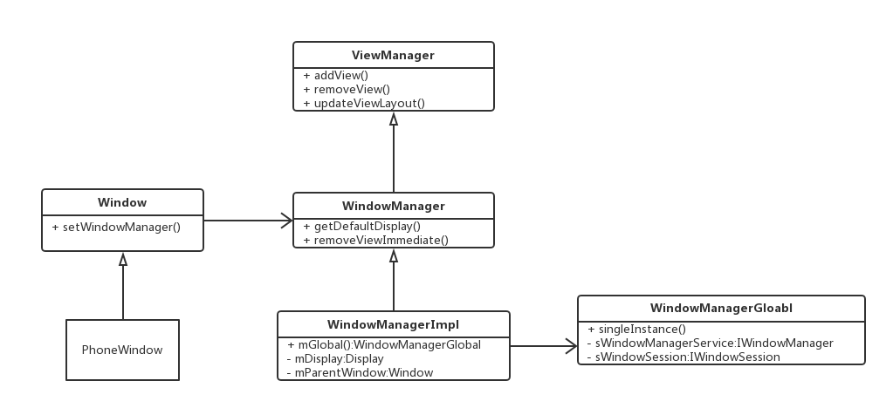
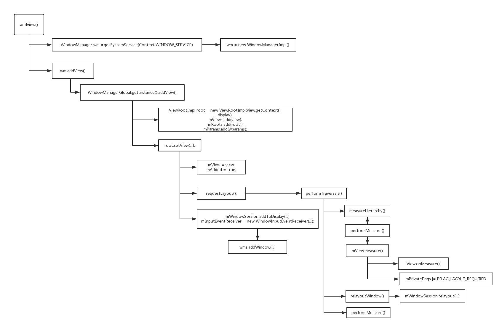
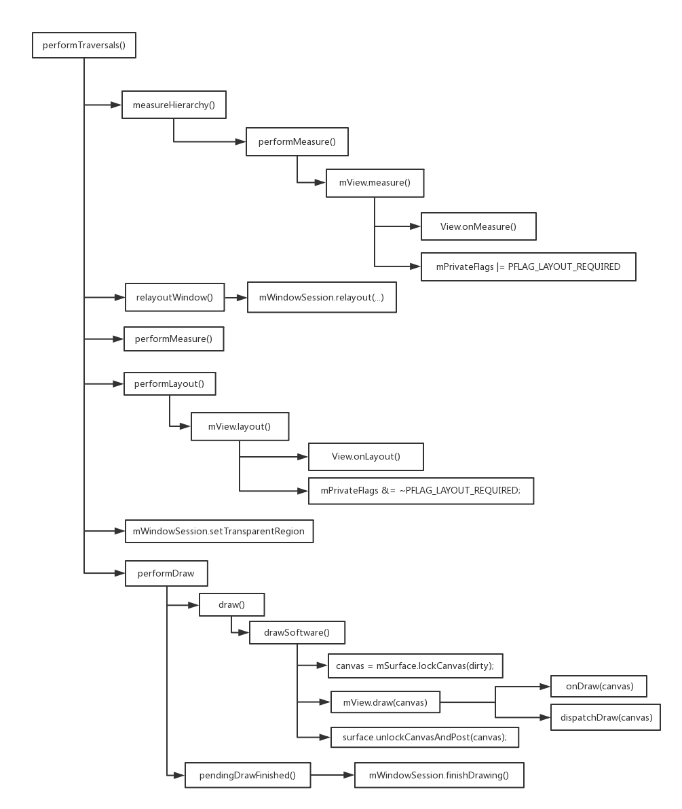
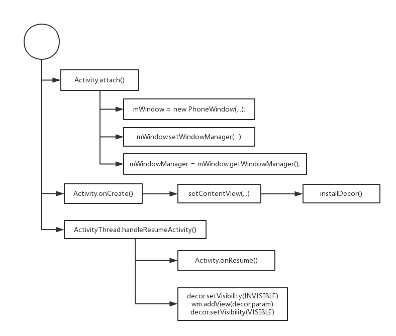

在wms服务中，我们可以直接使用它的api来创建一个窗口，显示出来并且通过InputEventReceiver接收输入事件。但是这种方法太原始,并且存在以下一些问题:
1. 需要完全的Android源码环境
2. 需要自己去处理UI元素的测量，布局和绘制
3. 还需要处理InputEventReceiver事件，分发到合适的窗口
4. wms来的各种回调
<!--more-->
因此Android提供了控件系统来帮我们完成各种各样的控件的创建。更高级一点的创建方式是获取 WindowManager,然后通过addView()方法得到一个可以交互的有界面的窗口

关于WindowManager的一个类图


## 窗口添加view的过程
然后是为窗口添加view所发生的调用过程



我们跟进WindManager.addView()过程，可以看到最终通过RootViewImpl.addView()调用到了PerformTraversals()。除此之外，
requestLayout()也会导致 PerformTraversals() 被调用：
```Java
    @Override
    public void requestLayout() {
        if (!mHandlingLayoutInLayoutRequest) {   //在layout过程中会被设置为true
            checkThread();
            mLayoutRequested = true;
            scheduleTraversals();
        }
    }

     void scheduleTraversals() {
        if (!mTraversalScheduled) {   //屏蔽重复的调用
            mTraversalScheduled = true;
            mTraversalBarrier = mHandler.getLooper().getQueue().postSyncBarrier();
            //即使performTraversals()执行比较快，在一次垂直同步的时间里最多只会调用performTraversals()一次
            mChoreographer.postCallback(Choreographer.CALLBACK_TRAVERSAL, mTraversalRunnable, null);  
            if (!mUnbufferedInputDispatch) {
                scheduleConsumeBatchedInput();
            }
            notifyRendererOfFramePending();
            pokeDrawLockIfNeeded();
        }
    }

    final class TraversalRunnable implements Runnable {
        @Override
        public void run() {
            doTraversal();
        }
    }

    void doTraversal() {
        if (mTraversalScheduled) {
            mTraversalScheduled = false;
            mHandler.getLooper().getQueue().removeSyncBarrier(mTraversalBarrier);

            if (mProfile) {
                Debug.startMethodTracing("ViewAncestor");
            }

            performTraversals();

            if (mProfile) {
                Debug.stopMethodTracing();
                mProfile = false;
            }
        }
    }
```

`performTraversals()`主要经过了以下几个阶段：

1. 预测量阶段，这里会对控件树第一次进行测量，计算出为了显示控件树所希望的窗口大小，将会依次调用view和子类的onMeasure()方法。
2. 布局窗口阶段，这里会把上一步得到的数据发给wms，wms会对窗口进行重新布局，计算出系统实际上给客户端的窗口大小并返回。
3. 最终测量阶段，这里只能接受wms给的窗口大小，并根据这个大小最终计算出控件树的实际大小，将会依次调用view和子类的onMeasure()方法。
4. 布局控件树， 上一步得到测量结果这里就可以计算出控件的位置，将会依次调用View和子类的onLayout()方法
5. 绘制。将会依次调用View和子类的onDraw()方法



需要注意的是， onMeasure和onLayout,onDraw都是可以跳过的

### 测量阶段(1,2,3)

第一次测量的时候，使用的 desiredWindowWidth 和 desiredWindowHeight 就是屏幕的大小，后面再测量的时候使用的就是上次测量得出的窗口大小了。在measureHierarchy可以看到，如果performMeasure()的结果带有标记MEASURED_STATE_TOO_SMALL，performMeasure()有可能被调用多次。

```Java
performTraversals(){
...
    if (mFirst) {
        mFullRedrawNeeded = true;
        mLayoutRequested = true;

        final Configuration config = mContext.getResources().getConfiguration();
        if (shouldUseDisplaySize(lp)) {
            // NOTE -- system code, won't try to do compat mode.
            ...
        } else {
            desiredWindowWidth = dipToPx(config.screenWidthDp);
            desiredWindowHeight = dipToPx(config.screenHeightDp);
        }
    else{
        desiredWindowWidth = frame.width();
        desiredWindowHeight = frame.height();
        if (desiredWindowWidth != mWidth || desiredWindowHeight != mHeight) {
            if (DEBUG_ORIENTATION) Log.v(mTag, "View " + host + " resized to: " + frame);
            mFullRedrawNeeded = true;
            mLayoutRequested = true;
            windowSizeMayChange = true;
        }
    }

    //没有开始绘制的时候可能会有消息过来，这时候要存在一个队列里面，开始绘制了再执行
    getRunQueue().executeActions(mAttachInfo.mHandler);

    boolean layoutRequested = mLayoutRequested && (!mStopped || mReportNextDraw);
    if (layoutRequested) {

        final Resources res = mView.getContext().getResources();

        if (mFirst) {
            // make sure touch mode code executes by setting cached value
            // to opposite of the added touch mode.
            mAttachInfo.mInTouchMode = !mAddedTouchMode;
            ensureTouchModeLocally(mAddedTouchMode);
        } else {
            ...
        }

        // Ask host how big it wants to be
        windowSizeMayChange |= measureHierarchy(host, lp, res,
                desiredWindowWidth, desiredWindowHeight);
    }


    private boolean measureHierarchy(final View host, final WindowManager.LayoutParams lp,
            final Resources res, final int desiredWindowWidth, final int desiredWindowHeight) {
        int childWidthMeasureSpec;
        int childHeightMeasureSpec;
        boolean windowSizeMayChange = false;

        if (DEBUG_ORIENTATION || DEBUG_LAYOUT) Log.v(mTag,
                "Measuring " + host + " in display " + desiredWindowWidth
                + "x" + desiredWindowHeight + "...");

        boolean goodMeasure = false;
        if (lp.width == ViewGroup.LayoutParams.WRAP_CONTENT) {
            // On large screens, we don't want to allow dialogs to just
            // stretch to fill the entire width of the screen to display
            // one line of text.  First try doing the layout at a smaller
            // size to see if it will fit.
            final DisplayMetrics packageMetrics = res.getDisplayMetrics();
            res.getValue(com.android.internal.R.dimen.config_prefDialogWidth, mTmpValue, true);
            int baseSize = 0;
            if (mTmpValue.type == TypedValue.TYPE_DIMENSION) {
                baseSize = (int)mTmpValue.getDimension(packageMetrics);
            }
            if (DEBUG_DIALOG) Log.v(mTag, "Window " + mView + ": baseSize=" + baseSize
                    + ", desiredWindowWidth=" + desiredWindowWidth);
            if (baseSize != 0 && desiredWindowWidth > baseSize) {
                childWidthMeasureSpec = getRootMeasureSpec(baseSize, lp.width);
                childHeightMeasureSpec = getRootMeasureSpec(desiredWindowHeight, lp.height);
                performMeasure(childWidthMeasureSpec, childHeightMeasureSpec);
                if (DEBUG_DIALOG) Log.v(mTag, "Window " + mView + ": measured ("
                        + host.getMeasuredWidth() + "," + host.getMeasuredHeight()
                        + ") from width spec: " + MeasureSpec.toString(childWidthMeasureSpec)
                        + " and height spec: " + MeasureSpec.toString(childHeightMeasureSpec));
                if ((host.getMeasuredWidthAndState()&View.MEASURED_STATE_TOO_SMALL) == 0) {
                    goodMeasure = true;
                } else {
                    // Didn't fit in that size... try expanding a bit.
                    baseSize = (baseSize+desiredWindowWidth)/2;
                    if (DEBUG_DIALOG) Log.v(mTag, "Window " + mView + ": next baseSize="
                            + baseSize);
                    childWidthMeasureSpec = getRootMeasureSpec(baseSize, lp.width);
                    performMeasure(childWidthMeasureSpec, childHeightMeasureSpec);
                    if (DEBUG_DIALOG) Log.v(mTag, "Window " + mView + ": measured ("
                            + host.getMeasuredWidth() + "," + host.getMeasuredHeight() + ")");
                    if ((host.getMeasuredWidthAndState()&View.MEASURED_STATE_TOO_SMALL) == 0) {
                        if (DEBUG_DIALOG) Log.v(mTag, "Good!");
                        goodMeasure = true;
                    }
                }
            }
        }

        if (!goodMeasure) {
            childWidthMeasureSpec = getRootMeasureSpec(desiredWindowWidth, lp.width);
            childHeightMeasureSpec = getRootMeasureSpec(desiredWindowHeight, lp.height);
            performMeasure(childWidthMeasureSpec, childHeightMeasureSpec);
            if (mWidth != host.getMeasuredWidth() || mHeight != host.getMeasuredHeight()) {
                windowSizeMayChange = true;
            }
        }

        if (DBG) {
            System.out.println("======================================");
            System.out.println("performTraversals -- after measure");
            host.debug();
        }

        return windowSizeMayChange;
    }

    private void performMeasure(int childWidthMeasureSpec, int childHeightMeasureSpec) {
        ...
        mView.measure(childWidthMeasureSpec, childHeightMeasureSpec);
        ...
    }

    public final void measure(int widthMeasureSpec, int heightMeasureSpec) {
        ...
        if (forceLayout || needsLayout) {
            // first clears the measured dimension flag
            mPrivateFlags &= ~PFLAG_MEASURED_DIMENSION_SET;

            resolveRtlPropertiesIfNeeded();

            int cacheIndex = forceLayout ? -1 : mMeasureCache.indexOfKey(key);
            if (cacheIndex < 0 || sIgnoreMeasureCache) {
                // measure ourselves, this should set the measured dimension flag back
                onMeasure(widthMeasureSpec, heightMeasureSpec);
                mPrivateFlags3 &= ~PFLAG3_MEASURE_NEEDED_BEFORE_LAYOUT;
            } else {
                long value = mMeasureCache.valueAt(cacheIndex);
                // Casting a long to int drops the high 32 bits, no mask needed
                setMeasuredDimensionRaw((int) (value >> 32), (int) value);
                mPrivateFlags3 |= PFLAG3_MEASURE_NEEDED_BEFORE_LAYOUT;
            }
            ...
            mPrivateFlags |= PFLAG_LAYOUT_REQUIRED; //measure里面会对flag进行设置，所以不能直接重写measure()，而是写onMeasure()
        }
        ...
    }
}
```


### 布局控件树
这里主要的工作内容是 performLayout() 和  mWindowSession.setTransparentRegion().

整个窗口默认都是透明区域，当普通控件加入时，控件会把自己的区域从透明区域移除掉，而SurfaceView会把自己的区域添加到当前窗口的透明区域中。
随后这个区域会被设置给wms,在surfaceFlinger对surface进行混合的时候，窗口的透明区域将会被忽略掉

需要注意的是在layout方法里面，会调用到setFrame来检查布局坐标是否变化，如果发生变化，就会调用invalidate(),此时一定会调用onDraw()

```Java
performTraversals(){
    ... //测量阶段(1,2,3)
    final boolean didLayout = layoutRequested && (!mStopped || mReportNextDraw);
    boolean triggerGlobalLayoutListener = didLayout|| mAttachInfo.mRecomputeGlobalAttributes;
    if (didLayout) {
        performLayout(lp, mWidth, mHeight);
        ...
        if (!mTransparentRegion.equals(mPreviousTransparentRegion)) {
            mPreviousTransparentRegion.set(mTransparentRegion);
            mFullRedrawNeeded = true;
            // reconfigure window manager
            try {
                mWindowSession.setTransparentRegion(mWindow, mTransparentRegion);
            } catch (RemoteException e) {
            }
        }
    }
    ... //绘制阶段
}

private void performLayout(WindowManager.LayoutParams lp, int desiredWindowWidth,int desiredWindowHeight) {
        ...
        final View host = mView;
        ...
        host.layout(0, 0, host.getMeasuredWidth(), host.getMeasuredHeight());
        ...
}

public void layout(int l, int t, int r, int b) {
    if ((mPrivateFlags3 & PFLAG3_MEASURE_NEEDED_BEFORE_LAYOUT) != 0) {
        onMeasure(mOldWidthMeasureSpec, mOldHeightMeasureSpec);
        mPrivateFlags3 &= ~PFLAG3_MEASURE_NEEDED_BEFORE_LAYOUT;
    }
    ...
    //注意这里，setOpticalFrame和setFrame都会调用到setFrame，里面可能会调用invalidate(),此时一定会调用onDraw()
    boolean changed = isLayoutModeOptical(mParent) ?setOpticalFrame(l, t, r, b) : setFrame(l, t, r, b);
    if (changed || (mPrivateFlags & PFLAG_LAYOUT_REQUIRED) == PFLAG_LAYOUT_REQUIRED) {
        onLayout(changed, l, t, r, b);

        if (shouldDrawRoundScrollbar()) {
            if(mRoundScrollbarRenderer == null) {
                mRoundScrollbarRenderer = new RoundScrollbarRenderer(this);
            }
        } else {
            mRoundScrollbarRenderer = null;
        }

        mPrivateFlags &= ~PFLAG_LAYOUT_REQUIRED;  ////layout里面会对flag进行设置，所以不能直接重写layout()，而是写onLayout()
        ...
    }
    ...
}

protected boolean setFrame(int left, int top, int right, int bottom) {
    boolean changed = false;
    if (mLeft != left || mRight != right || mTop != top || mBottom != bottom) {
        changed = true;
        ...
        boolean sizeChanged = (newWidth != oldWidth) || (newHeight != oldHeight);
        // Invalidate our old position
        invalidate(sizeChanged);
        ...
        if (sizeChanged) {
            sizeChange(newWidth, newHeight, oldWidth, oldHeight);
        }
        ...
    return changed;
}
```

### 绘制控件
1. 如果view不可见，不需要绘制
2. 如果surface是新创建的(比如从不可见到可见，此时会新创建surface)，不需要绘制，调用scheduleTraversals()下次再绘制。
3. 绘制的时候仅仅会对需要重绘的区域进行绘制，这部分区域称为脏区域。如果mDirty为空，有可能不会进行绘制。在控件中表示为`PFLAG_DIRTY`和`PFLAG_DIRTY_OPAQUE`,表示这个控件中是否有需要重绘的区域。其中`PFLAG_DIRTY_OPAQUE`表示此区域是不透明的，如果是整个控件，那就是意思是可以不用控件的底层背景，提高绘制效率。

```Java
performTraversals(){
    ... //测量阶段(1,2,3)
    ... //布局阶段
    boolean cancelDraw = mAttachInfo.mTreeObserver.dispatchOnPreDraw() || !isViewVisible;
    if (!cancelDraw && !newSurface) {
        if (mPendingTransitions != null && mPendingTransitions.size() > 0) {
            for (int i = 0; i < mPendingTransitions.size(); ++i) {
                mPendingTransitions.get(i).startChangingAnimations();
            }
            mPendingTransitions.clear();
        }
        performDraw();
    } else {
        if (isViewVisible) {
            scheduleTraversals();
        }
       ...
    }
}

private void performDraw() {
        if (mAttachInfo.mDisplayState == Display.STATE_OFF && !mReportNextDraw) {
            return;
        } else if (mView == null) {
            return;
        }

        final boolean fullRedrawNeeded = mFullRedrawNeeded;
        mFullRedrawNeeded = false;

        mIsDrawing = true;
        Trace.traceBegin(Trace.TRACE_TAG_VIEW, "draw");
        try {
            draw(fullRedrawNeeded);
        } finally {
            mIsDrawing = false;
            Trace.traceEnd(Trace.TRACE_TAG_VIEW);
        }
        ...
        pendingDrawFinished();
        ...
    }
```
这里主要有两个步骤，其中`pendingDrawFinished()`用来通知 wms 控件绘制结束，wms收到消息后就会把窗口的surface显示出来。
```Java
    void pendingDrawFinished() {
        if (mDrawsNeededToReport == 0) {
            throw new RuntimeException("Unbalanced drawPending/pendingDrawFinished calls");
        }
        mDrawsNeededToReport--;
        if (mDrawsNeededToReport == 0) {
            reportDrawFinished();
        }
    }

    private void reportDrawFinished() {
        try {
            mDrawsNeededToReport = 0;
            mWindowSession.finishDrawing(mWindow);
        } catch (RemoteException e) {
            // Have fun!
        }
    }
}
```
另一个则是 控件的绘制过程`draw(fullRedrawNeeded);`：
```Java
private void draw(boolean fullRedrawNeeded) {
        Surface surface = mSurface;
        ... // 控件滚动的相关计算

        final Rect dirty = mDirty;
        if (mSurfaceHolder != null) {
            // The app owns the surface, we won't draw.
            dirty.setEmpty();
            if (animating && mScroller != null) {
                mScroller.abortAnimation();
            }
            return;
        }

        if (fullRedrawNeeded) {
            mAttachInfo.mIgnoreDirtyState = true;
            dirty.set(0, 0, (int) (mWidth * appScale + 0.5f), (int) (mHeight * appScale + 0.5f));
        }
        ...
        if (!dirty.isEmpty() || mIsAnimating || accessibilityFocusDirty) {
            if (mAttachInfo.mThreadedRenderer != null && mAttachInfo.mThreadedRenderer.isEnabled()) {
               ...
            } else {
                ...
                if (!drawSoftware(surface, mAttachInfo, xOffset, yOffset, scalingRequired, dirty)) {
                    return;
                }
            }
        }
        ...
}

private boolean drawSoftware(Surface surface, AttachInfo attachInfo, int xoff, int yoff,
            boolean scalingRequired, Rect dirty) {

        // Draw with software renderer.
        final Canvas canvas;
        try {
            ...
            canvas = mSurface.lockCanvas(dirty);
            ...
        } catch (Surface.OutOfResourcesException e) {
           ...
        }

        try {
            ...
            mView.draw(canvas);
            ...
        } finally {
            surface.unlockCanvasAndPost(canvas);
            ...
        }
        return true;
    }

  public void draw(Canvas canvas) {
        final int privateFlags = mPrivateFlags;
        final boolean dirtyOpaque = (privateFlags & PFLAG_DIRTY_MASK) == PFLAG_DIRTY_OPAQUE &&
                (mAttachInfo == null || !mAttachInfo.mIgnoreDirtyState);
        mPrivateFlags = (privateFlags & ~PFLAG_DIRTY_MASK) | PFLAG_DRAWN;

        /*
         * Draw traversal performs several drawing steps which must be executed
         * in the appropriate order:
         *
         *      1. Draw the background
         *      2. If necessary, save the canvas' layers to prepare for fading
         *      3. Draw view's content
         *      4. Draw children
         *      5. If necessary, draw the fading edges and restore layers
         *      6. Draw decorations (scrollbars for instance)
         */

        // Step 1, draw the background, if needed
        int saveCount;

        if (!dirtyOpaque) {
            drawBackground(canvas);
        }

        // skip step 2 & 5 if possible (common case)
        final int viewFlags = mViewFlags;
        boolean horizontalEdges = (viewFlags & FADING_EDGE_HORIZONTAL) != 0;
        boolean verticalEdges = (viewFlags & FADING_EDGE_VERTICAL) != 0;
        //如果不需要绘制 渐变边界，则进入简便流程，跳过2，5步骤
        if (!verticalEdges && !horizontalEdges) {
            // Step 3, draw the content
            if (!dirtyOpaque) onDraw(canvas);

            // Step 4, draw the children
            dispatchDraw(canvas);

            drawAutofilledHighlight(canvas);

            // Overlay is part of the content and draws beneath Foreground
            if (mOverlay != null && !mOverlay.isEmpty()) {


                mOverlay.getOverlayView().dispatchDraw(canvas);
            }

            // Step 6, draw decorations (foreground, scrollbars)
            onDrawForeground(canvas);

            // Step 7, draw the default focus highlight
            drawDefaultFocusHighlight(canvas);

            if (debugDraw()) {
                debugDrawFocus(canvas);
            }

            // we're done...
            return;
        }
        //完整流程
        ...
    }
```
draw的draw()方法，简便流程主要有以下几步：
1. 绘制背景 `drawBackground()`
2. 绘制控件自身，`onDraw(canvas)`，默认空实现
3. 绘制子控件 `dispatchDraw(canvas);`，默认空实现 
4. 绘制装饰(前景色，滚动条,etc.) `onDrawForeground(canvas);`


## Activity和PhoneWindow



### PhoneWindow
通过 WindowManager ，ViewRootImpl 创建窗口的时候，我们仍然需要自行初始化 LayoutParams ，处理控件树的添加和删除等。 Android 在此之上又提供了一套机制，用于更简单的创建窗口和界面。而且 界面提供了预定义的样式，比如 标题栏，图标等，相比于自行创建符合Android规范的界面模板，进一步简化了开发者工作。这些工作是通过一个 com.view.Window 抽象类来实现的，目前它的唯一实现是PhoneWindow 类。我们仅仅需要通过setContentView()设置自己定义的控件树就可以得到一个带有标准模板的窗口界面，模板的样式取决于flag,theme等属性

### DecorView
DecorView 继承了 FrameLayout , 是 PhoneWindow 类里面的 控件树的根。预定义的样式就是由它实现，在我们通过setContentView()设置自己定义的View的时候，仅仅是设置View到DecorView里面成为它的子view。


## 控件焦点

* 触摸模式(Touch_mode)：在触摸模式下，一些控件比如菜单项，按钮等将不再可以保持或获取焦点，文本框等依然可以获取焦点
* 非触摸模式： 在这个模式下，菜单项，按钮等都可以获取焦点，通过方向键使焦点在这些控件之间游走，从而进行选择和确认

控件能否获取焦点的策略：
1. 当 NOT_FOCUSABLE 标记位于View.mViewFlags时，无法获取焦点
2. 当控件的父控件的DescendantFocusability 取值为 FOCUS_BLOCK_DESCENDANTS 时，无法获取焦点。
3. 当 FOCUSABLE 标记位于View.mViewFlags时，还有两种情况：
    1. 位于非触摸模式时，可以获取焦点
    2. 位于触摸模式的时候，View.mViewFlags 中存在 FUCUSABLE_IN_TOUCH_MODE标记可以获取焦点，否则不能获取焦点

获取到焦点的控件实际上只是增加了 PFLAG_FOCUSED 标记，而失去焦点则删除这个标记。对于获取到焦点的控件来说，它的父控件则会用 mFocused 变量来保存此控件，这样通过控件树的根节点可以迅速的一层层找到最终拥有焦点的控件。View类则提供两个方法来查询焦点的状态。
1. `isFocused()` 表示此控件是否含有`PFLAG_FOCUSED`标记，即焦点的持有者
2. `hasFocused()` 表示焦点是否在其内部，也就是自己或者子控件持有焦点

## 输入事件的派发

在ViewRootImpl.setView()中，ViewRootImpl使用wms分配的 InputChannel 创建了 InputEventReceiver 来接收输入事件，它们通过 onInputEvent()回调来得到事件并且进行处理：
```java
void setview(...){
    ...
    mInputEventReceiver = new WindowInputEventReceiver(mInputChannel,Looper.myLooper());
    ...
    mSyntheticInputStage = new SyntheticInputStage();
    InputStage viewPostImeStage = new ViewPostImeInputStage(mSyntheticInputStage);
    InputStage nativePostImeStage = new NativePostImeInputStage(viewPostImeStage,"aq:native-post-ime:" + counterSuffix);
    InputStage earlyPostImeStage = new EarlyPostImeInputStage(nativePostImeStage);
    InputStage imeStage = new ImeInputStage(earlyPostImeStage,"aq:ime:" + counterSuffix);
    InputStage viewPreImeStage = new ViewPreImeInputStage(imeStage);
    InputStage nativePreImeStage = new NativePreImeInputStage(viewPreImeStage,"aq:native-pre-ime:" + counterSuffix);

    mFirstInputStage = nativePreImeStage;
    mFirstPostImeInputStage = earlyPostImeStage;
    mPendingInputEventQueueLengthCounterName = "aq:pending:" + counterSuffix;
}

void enqueueInputEvent(InputEvent event,
        InputEventReceiver receiver, int flags, boolean processImmediately) {
    adjustInputEventForCompatibility(event);
    QueuedInputEvent q = obtainQueuedInputEvent(event, receiver, flags);
    ... //输入事件加入到链表中
    if (processImmediately) {
        doProcessInputEvents();
    } else {
        //稍后处理，通过handler还是会走到doProcessInputEvents()中
        scheduleProcessInputEvents();
    }

void doProcessInputEvents() {
    // Deliver all pending input events in the queue.
    while (mPendingInputEventHead != null) {
        QueuedInputEvent q = mPendingInputEventHead;
        mPendingInputEventHead = q.mNext;
        ...
        deliverInputEvent(q);
    }
    ...
}

private void deliverInputEvent(QueuedInputEvent q) {
    Trace.asyncTraceBegin(Trace.TRACE_TAG_VIEW, "deliverInputEvent",
            q.mEvent.getSequenceNumber());
    if (mInputEventConsistencyVerifier != null) {
        mInputEventConsistencyVerifier.onInputEvent(q.mEvent, 0);
    }

    InputStage stage;
    if (q.shouldSendToSynthesizer()) {
        stage = mSyntheticInputStage;
    } else {
        stage = q.shouldSkipIme() ? mFirstPostImeInputStage : mFirstInputStage;
    }

    if (stage != null) {
        stage.deliver(q);
    } else {
        //做一些清理回收工作
        finishInputEvent(q);
    }
}
```
其中，输入事件在这里被定义成了几个类型：
1. keyEvent 按键事件
2. PointerEvent 触摸事件 
3. TrackballEvent 轨迹球事件
4. GenericMotionEvent 其他事件，比如悬浮(HOVER)事件，游戏手柄等

而 InputStage 是一个基类，通过Wrapper模式不断的调用apply和forward方法来进行链式调用，定义了6个state，在各个阶段会选择性处理感兴趣的事件，在任一阶段事件被消耗掉了都不会继续传递:
1. nativePreImeStage : 这里会把输入事件传给native层看看是否要处理
2. viewPreImeStage ： 这里会把输入事件交给view去处理，对 keyEvent事件 调用 `mView.dispatchKeyEventPreIme(event)`
3. imeStage : 这里会把输入事件交给输入法窗口去处理，调用`imm.dispatchInputEvent(event, q, this, mHandler)`
4. earlyPostImeStage ：这里会进行一些状态记录，触摸模式的确认和退出等
5. nativePostImeStage ： 同1一样，只不过这里是在 输入法窗口处理 之后再次传给 native 层
6. viewPostImeStage ： 把输入事件交给view去处理
    ```Java
    protected int onProcess(QueuedInputEvent q) {
        if (q.mEvent instanceof KeyEvent) {
            return processKeyEvent(q);
        } else {
            final int source = q.mEvent.getSource();
            if ((source & InputDevice.SOURCE_CLASS_POINTER) != 0) {
                return processPointerEvent(q);
            } else if ((source & InputDevice.SOURCE_CLASS_TRACKBALL) != 0) {
                return processTrackballEvent(q);
            } else {
                return processGenericMotionEvent(q);
            }
        }
    }
    ```

### 按键事件 
keyEvent 按键事件是基于焦点派发的，因为在非触摸模式下，输入法窗口无法获取到焦点，因此在这里会给输入法窗口一个处理的机会。对于view来说，处理的逻辑相对比较简单，如果自己拥有焦点，则调用自己的`view.onKeyPreIme()`方法去处理，否则调用`mFocused.dispatchKeyEventPreIme(event)`

### 触摸事件 
```java
// ViewRootImply::processPointerEvent
private int processPointerEvent(QueuedInputEvent q) {
    final MotionEvent event = (MotionEvent)q.mEvent;
    ...
    boolean handled = mView.dispatchPointerEvent(event);
    ...
    return handled ? FINISH_HANDLED : FORWARD;
}

//View::dispatchPointerEvent()
public final boolean dispatchPointerEvent(MotionEvent event) {
    if (event.isTouchEvent()) {
        return dispatchTouchEvent(event);
    } else {
        return dispatchGenericMotionEvent(event);
    }
}
```

多点触摸 ： 
触摸事件被封装为一个 MotionEvent 类，在多点触摸的情况下，即使 MotionEvent 由一个触摸点触发，它也包含所有触控点的位置信息。这时候通过 `MotionEvent.getAction()`获取的是一个复合值，低8位描述了动作，高8位描述了触控点的索引号。我们可以通过`MotionEvent.getActionMasked()`和`MotionEvent.getActionIndex()`分别获取这两个值。`MotionEvent.getX(index)`和`MotionEvent.getY(index)`则接受索引号为参数返回此触摸点的位置。

索引号不是固定的，比如当我们使用 AB两个手指按下的时候，它们会分别获得的索引号是0和1，当A抬起后，B的索引号则变成了0。但是我们可以通过`MotionEvent.getPointerId(index)`来获取这个索引号对应的触控点的pointerId,这个值则是在不变的
```java
//ACTION_DOWN 是第一个手指按下 ，ACTION_UP 是最后一个手指抬起
ACTION_DOWN --> ACTION_POINTER_DOWN -->ACTION_POINTER_DOWN --> ACTION_POINTER_UP --> ACTION_POINTER_UP --> ACTION_UP

```

`dispatchTouchEvent()`有View和ViewGroup两种实现 :
```java
// View::dispatchTouchEvent()
public boolean dispatchTouchEvent(MotionEvent event) {
    ...
    boolean result = false;
    ...
    if (onFilterTouchEventForSecurity(event)) {
        if ((mViewFlags & ENABLED_MASK) == ENABLED && handleScrollBarDragging(event)) {
            result = true;
        }
        //noinspection SimplifiableIfStatement
        ListenerInfo li = mListenerInfo;
        if (li != null && li.mOnTouchListener != null && (mViewFlags & ENABLED_MASK) == ENABLED
                && li.mOnTouchListener.onTouch(this, event)) {
            result = true;
        }
        if (!result && onTouchEvent(event)) {
            result = true;
        }
    }

    ...
    return result;
}
```
对于View来说， dispatchTouchEvent() 主要做了两件事， 先把事件给`mOnTouchListener`处理，如果`mOnTouchListener`没有消耗掉，则交给`onTouchEvent(event)`处理。
ViewGroup的 dispatchTouchEvent() 相对来说比较复杂，总体来说，分以下几个步骤：
1. 准备工作：
    1. 过滤可能导致安全问题的触控事件
    2. 如果是`ACTION_DOWN`则清空之前留下的touchTarget和touchState
    3. 处理 ViewGroup 的拦截的问题 
2. 开始寻找派发目标：
    1. 记下触摸事件的pointId
    2. 按照一定的顺序遍历child，如果触摸点不在child的控件范围内，则排除掉，否则尝试在自己保存的TouchTarget链表中寻找;如果寻找到这个child,那么把后续的事件都交给它，寻找派发目标结束;如果在自己保存的TouchTarget链表中没有找到,那么尝试调用 `dispatchTransformedTouchEvent(...)` 把此次触摸事件派发给这个child控件，并且为这个child生成新的TouchTarget使用头插法加入到保存的链表中，如果调用返回false,表示这个子控件不是派发目标，则继续循环这个过程
3. 开始派发事件：
    1. 如果TouchTarget链表为空，则发给自己
    2. 取出 TouchTarget 的节点，如果已经在上面第二步中派发完成了，则结束派发，否则尝试调用`dispatchTransformedTouchEvent(...)`把此次触摸事件派发给它，如果取消了事件，则需要回收掉该节点。如果失败，则继续尝试下一个节点

派发的函数`dispatchTransformedTouchEvent(...)`如下所示：
```java
/**
    * Transforms a motion event into the coordinate space of a particular child view,
    * filters out irrelevant pointer ids, and overrides its action if necessary.
    * If child is null, assumes the MotionEvent will be sent to this ViewGroup instead.
    */
private boolean dispatchTransformedTouchEvent(MotionEvent event, boolean cancel,
        View child, int desiredPointerIdBits) {
    final boolean handled;

    // Canceling motions is a special case.  We don't need to perform any transformations
    // or filtering.  The important part is the action, not the contents.
    final int oldAction = event.getAction();
    if (cancel || oldAction == MotionEvent.ACTION_CANCEL) {
        event.setAction(MotionEvent.ACTION_CANCEL);
        if (child == null) {
            handled = super.dispatchTouchEvent(event);
        } else {
            handled = child.dispatchTouchEvent(event);
        }
        event.setAction(oldAction);
        return handled;
    }

    // Calculate the number of pointers to deliver.
    final int oldPointerIdBits = event.getPointerIdBits();
    final int newPointerIdBits = oldPointerIdBits & desiredPointerIdBits;

    // If for some reason we ended up in an inconsistent state where it looks like we
    // might produce a motion event with no pointers in it, then drop the event.
    if (newPointerIdBits == 0) {
        return false;
    }

    // If the number of pointers is the same and we don't need to perform any fancy
    // irreversible transformations, then we can reuse the motion event for this
    // dispatch as long as we are careful to revert any changes we make.
    // Otherwise we need to make a copy.
    final MotionEvent transformedEvent;
    if (newPointerIdBits == oldPointerIdBits) {
        if (child == null || child.hasIdentityMatrix()) {
            if (child == null) {
                handled = super.dispatchTouchEvent(event);
            } else {
                final float offsetX = mScrollX - child.mLeft;
                final float offsetY = mScrollY - child.mTop;
                event.offsetLocation(offsetX, offsetY);

                handled = child.dispatchTouchEvent(event);

                event.offsetLocation(-offsetX, -offsetY);
            }
            return handled;
        }
        transformedEvent = MotionEvent.obtain(event);
    } else {
        transformedEvent = event.split(newPointerIdBits);
    }

    // Perform any necessary transformations and dispatch.
    if (child == null) {
        handled = super.dispatchTouchEvent(transformedEvent);
    } else {
        final float offsetX = mScrollX - child.mLeft;
        final float offsetY = mScrollY - child.mTop;
        transformedEvent.offsetLocation(offsetX, offsetY);
        if (! child.hasIdentityMatrix()) {
            transformedEvent.transform(child.getInverseMatrix());
        }

        handled = child.dispatchTouchEvent(transformedEvent);
    }

    // Done.
    transformedEvent.recycle();
    return handled;
}
```
注释写的很清楚，这个函数的主要功能是：
1. 把一个motionEvent转化为childview坐标下的坐标点位置。
2. 过滤不感兴趣的pointerId触摸点
3. 可能的情况下，修改Action的值。
4. 如果传入的child为空，则派发给viewGroup自己

其中，比较复杂的则是 修改Action的值 ，这个涉及到多点触摸的原理和过程，需要另外分析。


在 ViewGroup 的处理中，有个比较神奇的操作
```java
final int idBitsToAssign = split ? 1 << ev.getPointerId(actionIndex): TouchTarget.ALL_POINTER_IDS;
```
它使用idBitsToAssign 这样一个int值来记录触摸点的信息，因为一个int值最多32bit,所以对于每一个TouchTarget，最多支持32个触摸点
