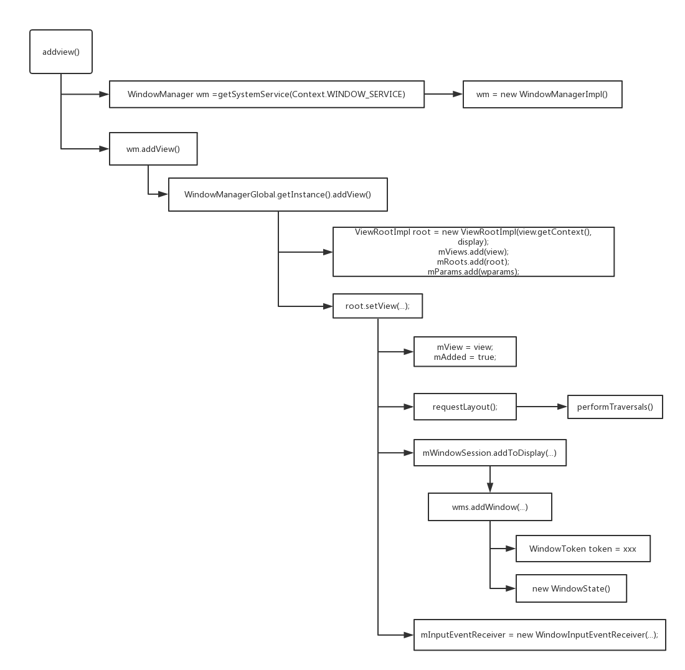

首先是关于WindowManager的一个类图，这个不用解释了一看就明白。<!--more-->


然后是为窗口添加view所发生的调用过程



## PerformTraversals()
`performTraversals()`主要经过了以下几个阶段：
1. 预测量阶段，这里会对控件树第一次进行测量，计算出为了显示控件树所希望的窗口大小，将会依次调用view和子类的onMeasure()方法。
2. 布局窗口阶段，这里会把上一步得到的数据发给wms，wms会对窗口进行重新布局，计算出系统实际上给客户端的窗口大小并返回。
3. 最终测量阶段，这里只能接受wms给的窗口大小，并根据这个大小最终计算出控件树的实际大小，将会依次调用view和子类的onMeasure()方法。
4. 布局控件树， 上一步得到测量结果这里就可以计算出控件的位置，将会依次调用View和子类的onLayout()方法
5. 绘制。将会依次调用View和子类的onDraw()方法


### 测量阶段(1,2,3)
```Java
performTraversals(){
...
    if (mFirst) {
        mFullRedrawNeeded = true;
        mLayoutRequested = true;

        final Configuration config = mContext.getResources().getConfiguration();
        if (shouldUseDisplaySize(lp)) {
            // NOTE -- system code, won't try to do compat mode.
            ...
        } else {
            desiredWindowWidth = dipToPx(config.screenWidthDp);
            desiredWindowHeight = dipToPx(config.screenHeightDp);
        }
    else{
        desiredWindowWidth = frame.width();
        desiredWindowHeight = frame.height();
        if (desiredWindowWidth != mWidth || desiredWindowHeight != mHeight) {
            if (DEBUG_ORIENTATION) Log.v(mTag, "View " + host + " resized to: " + frame);
            mFullRedrawNeeded = true;
            mLayoutRequested = true;
            windowSizeMayChange = true;
        }
    }

    //没有开始绘制的时候可能会有消息过来，这时候要存在一个队列里面，开始绘制了再执行
    getRunQueue().executeActions(mAttachInfo.mHandler);

    boolean layoutRequested = mLayoutRequested && (!mStopped || mReportNextDraw);
    if (layoutRequested) {

        final Resources res = mView.getContext().getResources();

        if (mFirst) {
            // make sure touch mode code executes by setting cached value
            // to opposite of the added touch mode.
            mAttachInfo.mInTouchMode = !mAddedTouchMode;
            ensureTouchModeLocally(mAddedTouchMode);
        } else {
            ...
        }

        // Ask host how big it wants to be
        windowSizeMayChange |= measureHierarchy(host, lp, res,
                desiredWindowWidth, desiredWindowHeight);
    }


    private boolean measureHierarchy(final View host, final WindowManager.LayoutParams lp,
            final Resources res, final int desiredWindowWidth, final int desiredWindowHeight) {
        int childWidthMeasureSpec;
        int childHeightMeasureSpec;
        boolean windowSizeMayChange = false;

        if (DEBUG_ORIENTATION || DEBUG_LAYOUT) Log.v(mTag,
                "Measuring " + host + " in display " + desiredWindowWidth
                + "x" + desiredWindowHeight + "...");

        boolean goodMeasure = false;
        if (lp.width == ViewGroup.LayoutParams.WRAP_CONTENT) {
            // On large screens, we don't want to allow dialogs to just
            // stretch to fill the entire width of the screen to display
            // one line of text.  First try doing the layout at a smaller
            // size to see if it will fit.
            final DisplayMetrics packageMetrics = res.getDisplayMetrics();
            res.getValue(com.android.internal.R.dimen.config_prefDialogWidth, mTmpValue, true);
            int baseSize = 0;
            if (mTmpValue.type == TypedValue.TYPE_DIMENSION) {
                baseSize = (int)mTmpValue.getDimension(packageMetrics);
            }
            if (DEBUG_DIALOG) Log.v(mTag, "Window " + mView + ": baseSize=" + baseSize
                    + ", desiredWindowWidth=" + desiredWindowWidth);
            if (baseSize != 0 && desiredWindowWidth > baseSize) {
                childWidthMeasureSpec = getRootMeasureSpec(baseSize, lp.width);
                childHeightMeasureSpec = getRootMeasureSpec(desiredWindowHeight, lp.height);
                performMeasure(childWidthMeasureSpec, childHeightMeasureSpec);
                if (DEBUG_DIALOG) Log.v(mTag, "Window " + mView + ": measured ("
                        + host.getMeasuredWidth() + "," + host.getMeasuredHeight()
                        + ") from width spec: " + MeasureSpec.toString(childWidthMeasureSpec)
                        + " and height spec: " + MeasureSpec.toString(childHeightMeasureSpec));
                if ((host.getMeasuredWidthAndState()&View.MEASURED_STATE_TOO_SMALL) == 0) {
                    goodMeasure = true;
                } else {
                    // Didn't fit in that size... try expanding a bit.
                    baseSize = (baseSize+desiredWindowWidth)/2;
                    if (DEBUG_DIALOG) Log.v(mTag, "Window " + mView + ": next baseSize="
                            + baseSize);
                    childWidthMeasureSpec = getRootMeasureSpec(baseSize, lp.width);
                    performMeasure(childWidthMeasureSpec, childHeightMeasureSpec);
                    if (DEBUG_DIALOG) Log.v(mTag, "Window " + mView + ": measured ("
                            + host.getMeasuredWidth() + "," + host.getMeasuredHeight() + ")");
                    if ((host.getMeasuredWidthAndState()&View.MEASURED_STATE_TOO_SMALL) == 0) {
                        if (DEBUG_DIALOG) Log.v(mTag, "Good!");
                        goodMeasure = true;
                    }
                }
            }
        }

        if (!goodMeasure) {
            childWidthMeasureSpec = getRootMeasureSpec(desiredWindowWidth, lp.width);
            childHeightMeasureSpec = getRootMeasureSpec(desiredWindowHeight, lp.height);
            performMeasure(childWidthMeasureSpec, childHeightMeasureSpec);
            if (mWidth != host.getMeasuredWidth() || mHeight != host.getMeasuredHeight()) {
                windowSizeMayChange = true;
            }
        }

        if (DBG) {
            System.out.println("======================================");
            System.out.println("performTraversals -- after measure");
            host.debug();
        }

        return windowSizeMayChange;
    }

    private void performMeasure(int childWidthMeasureSpec, int childHeightMeasureSpec) {
        ...
        mView.measure(childWidthMeasureSpec, childHeightMeasureSpec);
        ...
    }

    public final void measure(int widthMeasureSpec, int heightMeasureSpec) {
        ...
        if (forceLayout || needsLayout) {
            // first clears the measured dimension flag
            mPrivateFlags &= ~PFLAG_MEASURED_DIMENSION_SET;

            resolveRtlPropertiesIfNeeded();

            int cacheIndex = forceLayout ? -1 : mMeasureCache.indexOfKey(key);
            if (cacheIndex < 0 || sIgnoreMeasureCache) {
                // measure ourselves, this should set the measured dimension flag back
                onMeasure(widthMeasureSpec, heightMeasureSpec);
                mPrivateFlags3 &= ~PFLAG3_MEASURE_NEEDED_BEFORE_LAYOUT;
            } else {
                long value = mMeasureCache.valueAt(cacheIndex);
                // Casting a long to int drops the high 32 bits, no mask needed
                setMeasuredDimensionRaw((int) (value >> 32), (int) value);
                mPrivateFlags3 |= PFLAG3_MEASURE_NEEDED_BEFORE_LAYOUT;
            }
            ...
            mPrivateFlags |= PFLAG_LAYOUT_REQUIRED;
        }

        mOldWidthMeasureSpec = widthMeasureSpec;
        mOldHeightMeasureSpec = heightMeasureSpec;

        mMeasureCache.put(key, ((long) mMeasuredWidth) << 32 |
                (long) mMeasuredHeight & 0xffffffffL); // suppress sign extension
    }
}
```
第一次测量的时候，使用的 desiredWindowWidth 和 desiredWindowHeight 就是屏幕的大小，后面再测量的时候使用的就是上次测量得出的窗口大小了。在measureHierarchy可以看到，如果performMeasure()的结果带有标记MEASURED_STATE_TOO_SMALL，performMeasure()有可能被调用多次。