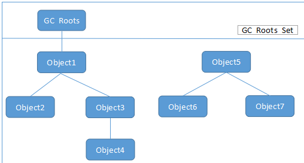

来源：《深入理解Java虚拟机(第2版)》

通常来说，人们会把Java和垃圾收集器(GC)绑定在一起，事实上GC的历史比Java要更久远。GC一般需要完成三件事：

- 哪些内存需要回收
- 什么时候进行回收
- 怎么回收

<!--more-->

对于Java来说，

- 程序计数器，虚拟机栈，本地方法栈3个区域，因为它们都是线程私有的，线程结束了它们也就回收了，而栈的栈帧随着方法的调用有序的执行入栈和出栈的操作，因此方法结束时，这部分也回收了；
- Java堆和方法区，这部分的内存分配和回收都是动态的，不确定的，因此也是GC所关注的区域。

## 对象存活判定

### 引用计数法

简单的引用计数法是这样的：给对象添加一个引用计数器，引用时+1,失效时-1，计数器为0时则对象可以被回收。在实际应用中可能会更复杂一些，比如可以把引用分为多种类型（比如弱引用），根据不同类型引用的数量来决定不同的内存回收策略。目前来说，主流的Java虚拟机都没有采用引用计数法来管理内存，其中最主要的原因是解决对象间相互循环引用的问题会很复杂。

### 可达性分析

基本思想是：通过GC Roots对象作为起点，从这些节点开始向下搜索，搜索的路径称为引用链。当一个对象到GC Roots没有任何引用链连接时，称这个对象不可达。Java中做为GCRoots的对象：

   a.虚拟机栈(栈桢中的本地变量表)中的引用的对象
   b.方法区中的类静态属性引用的对象
   c.方法区中的常量引用的对象
   d.本地方法栈中JNI的引用的对象 

`Object 1234可达，567不可达`

### 引用

无论是通过引用计数算法判断对象的引用数量，还是通过根搜索算法判断对象的引用链是否可达，判定对象是否存活都与“引用”有关。 JDK 1.2之后，Java对引用的概念进行了扩充，将引用分为强引用（Strong Reference）、软引用（Soft Reference）、弱引用（Weak Reference）、虚引用（Phantom Reference）四种，这四种引用强度依次逐渐减弱。  

- 强引用就是指在程序代码之中普遍存在的，类似“Object obj = new Object()”这类的引用，只要强引用还存在，垃圾收集器永远不会回收掉被引用的对象。
- 软引用用来描述一些还有用，但并非必需的对象。对于软引用关联着的对象，在系统将要发生内存溢出异常之前，将会把这些对象列进回收范围之中并进行第二次回收。如果这次回收还是没有足够的内存，才会抛出内存溢出异常。在JDK 1.2之后，提供了SoftReference类来实现软引用。
- 弱引用也是用来描述非必需对象的，但是它的强度比软引用更弱一些，被弱引用关联的对象只能生存到下一次垃圾收集发生之前。当垃圾收集器工作时，无论当前内存是否足够，都会回收掉只被弱引用关联的对象。在JDK 1.2之后，提供了WeakReference类来实现弱引用。
- 虚引用也称为幽灵引用或者幻影引用，它是最弱的一种引用关系。一个对象是否有虚引用的存在，完全不会对其生存时间构成影响，也无法通过虚引用来取得一个对象实例。为一个对象设置虚引用关联的唯一目的就是希望能在这个对象被收集器回收时收到一个系统通知。在JDK 1.2之后，提供了PhantomReference类来实现虚引用。

## GC算法

- 标记-清除算法

算法分为“标记”和“清除”两个阶段：首先标记出所有需要回收的对象，在标记完成后统一回收掉所有被标记的对象。它的主要缺点有两个：一个是效率问题，标记和清除过程的效率都不高；另外一个是空间问题，标记清除之后会产生大量不连续的内存碎片，空间碎片太多可能会导致，当程序在以后的运行过程中需要分配较大对象时无法找到足够的连续内存而不得不提前触发另一次垃圾收集动作。

- 复制算法

将可用内存按容量划分为大小相等的两块，每次只使用其中的一块。当这一块的内存用完了，就将还存活着的对象复制到另外一块上面，然后再把已使用过的内存空间一次清理掉。这样使得每次都是对其中的一块进行内存回收，内存分配时也就不用考虑内存碎片等复杂情况，只要移动堆顶指针，按顺序分配内存即可，实现简单，运行高效。只是这种算法的代价是将内存缩小为原来的一半，未免太高了一点。

现代商业虚拟机多半采用这种收集算法来回收新生代。因为新生代中的对象大部分生存周期都很多，因此不需要按照1:1的比例来划分，而是将内存分为一块较大的Eden区和两块较小的Survivor区，每次使用Eden和一块Survivor区，回收的时候，将它们中还存活的对象复制到另外一块Survivor区上，然后清理掉Eden和刚才用过的Survivor区。HotSpot虚拟机默认的Eden和Survivor大小的比例是8：1，也就是说，新生代可用空间会90%，只有10%会用来保存。

- 标记-整理算法

标记过程仍然与“标记-清除”算法一样，但后续步骤不是直接对可回收对象进行清理，而是让所有存活的对象都向一端移动，然后直接清理掉端边界以外的内存。

- 分代收集算法

当前商业虚拟机的垃圾收集都采用“分代收集”（Generational Collection）算法，根据对象的存活周期的不同将内存划分为几块。一般是把Java堆分为新生代和老年代，这样就可以根据各个年代的特点采用最适当的收集算法。在新生代中，每次垃圾收集时都发现有大批对象死去，只有少量存活，那就选用复制算法，只需要付出少量存活对象的复制成本就可以完成收集。而老年代中因为对象存活率高、没有额外空间对它进行分配担保，就必须使用“标记-清理”或“标记-整理”算法来进行回收

## HotSpot实现

### 枚举根节点

枚举根节点面临的主要问题有两个：

- 可作为GC Roots的节点太多，主要在全局性的引用（例如常量或类静态属性）与执行上下文（例如栈帧中的本地变量表）中，现在很多应用仅仅方法区就有数百兆，如果要逐个检查这里面的引用，那么必然会消耗很多时间。在HotSpot的实现中，是使用一组称为OopMap的数据结构来达到这个目的的，在类加载完成的时候，HotSpot就把对象内什么偏移量上是什么类型的数据计算出来，在JIT编译过程中，也会在特定的位置记录下栈和寄存器中哪些位置是引用。这样，GC在扫描时就可以直接得知这些信息了，这是典型的空间换时间的做法；
- GC停顿，因为这项分析工作必须在一个能确保一致性的快照中进行——这里“一致性”的意思是指在整个分析期间整个执行系统看起来就像被冻结在某个时间点上，不可以出现分析过程中对象引用关系还在不断变化的情况，该点不满足的话分析结果准确性就无法得到保证。这点是导致GC进行时必须停顿所有Java执行线程（Sun将这件事情称为“Stop The World”）的其中一个重要原因，即使是在号称（几乎）不会发生停顿的CMS收集器中，枚举根节点时也是必须要停顿的。

### 安全点

- 程序执行时并非在所有的地方都能停下来开始GC，只有在安全点是才能暂停，它的定义是：

  A point during program execution at which all GC roots are known and all heap object contents are consistent. From a global point of view, all threads must block at a safepoint before the GC can run.

- 在哪里设置安全点 

  安全点的设置既不能太少以至于让GC长时间等待，也不能太多以至于过分增大运行时的负荷

- 如何在GC发生时让所有的线程都停到安全点：

  - 抢先式中断   GC发生时，直接把所有的线程中断，如果发现有线程中断的地方不在安全点上，就恢复线程，让它跑到安全点上。现在几乎没有虚拟机采用这种方式
  - 主动式中断    GC需要中断线程的时候，仅仅简单的设置一个标志，让Java线程运行到safepoint的时候主动检查这个标志位，如果标志被设置，那么线程停顿，如果没有被设置，那么继续执行。

### 安全区域

安全区域是指在一段代码片段之中，引用关系不会发生变化，在这个区域的任何时间开始GC都是安全的。

当程序执行到safe region中的代码时，首先标识自己已经进入了safe region，当jvm要发起gc时，则可以不用管标识了这种状态的线程了。在线程要离开safe region时，它需要检查当前GC状态，如果不能离开就必须等待直到收到信号可以离开为止。

Safepoint机制保证了程序在执行的时候，在不太长的时间里就可以进入到GC的安全点，但是如果此时程序没有被分配时间，比如线程处于sleep或者block状态，则无法响应jvm的请求。这时候需要安全区域来解决，我们可以把安全区域看成是扩展了的安全点。

## 垃圾收集器

不同的虚拟机会包含不同的垃圾收集器，[在最新的Java 9 中，使用G1作为默认的收集器](https://blogs.oracle.com/whats-cool-in-java-8-new-in-java-9)。

## 内存的回收和分配策略

- 对象优先在Eden分配

大多数情况下，对象在新生代的Eden区分配，当Eden区没有足够的空间分配时，虚拟机将发起一次GC，如果GC期间发现Survivor空间不够保存，此时会转移对象到老年代。

- 大对象直接进入老年代

大对象是指需要大量连续内存空间的Java对象，比如很长的字符串和数组，经常出现大对象容易导致内存还有不少空间时就触发垃圾收集以获取足够的连续空间；

- 长期存活的对象将进入老年代

虚拟机给每个对象定义了一个对象年龄计数器，一次GC后，年龄加1，当Survivor中的对象经过多次gc时就会被转移到老年代中。

> Minor GC 和 Full GC ：
>
> 新生代GC（Minor GC）：是指发生在新生代的GC，因为新生代对象朝生夕灭的特性，所以Minor GC发生的很频繁，回收速度也比较快
>
> 老年代GC（Major GC / Full GC）：是指发生在老年代的GC,此GC的速度一般会比Minor GC慢10倍以上

扩展阅读：

http://blog.csdn.net/lqp276/article/details/52249438

http://blog.csdn.net/iter_zc/article/details/41847887

https://www.zhihu.com/question/29268019

https://www.zhihu.com/question/51914583/answer/128083814

呃，在面试里面被问到，哪些对象可以作为GC roots的对象，为什么它们可以作为gc roots对象？解释一下为什么Activity里面handler会导致内存泄露的问题,它们的gcRoot路径是什么样的？

当时没有答出来.....以下是个人根据网上的一些资料的想法整理，不是答案：

> tracing gc的基本思路是，以当前存活的对象集为root，遍历出他们（引用）关联的所有对象（Heap中的对象），没有遍历到的对象即为非存活对象，这部分对象可以gc掉。这里的**初始存活对象集**就是GC Roots。
>
> 1.JAVA虚拟机栈中的本地变量引用对象； 2.方法区中静态变量引用的对象； 3.方法区中常量引用的对象； 4.本地方法栈中JNI引用的对象；
>
> 选择这些对象的依据是什么？
>
> 当前栈帧中的引用型变量；静态变量引用的对象；本地方法栈JNI的引用对象，很明显是当前存活对象。所以他们比如是GC Roots的一部分。

https://www.zhihu.com/question/33093157

还有这里

> 作者：Accelerator链接：https://www.zhihu.com/question/50381439/answer/120846441来源：知乎著作权归作者所有。商业转载请联系作者获得授权，非商业转载请注明出处。
>
> A garbage collection root is an object that is accessible from outside the heap. The following reasons make an object a GC root:
>
> 1.System Class
> ----------Class loaded by bootstrap/system class loader. For example, everything from the rt.jar like java.util.* .
> 2.JNI Local
> ----------Local variable in native code, such as user defined JNI code or JVM internal code.
> 3.JNI Global
> ----------Global variable in native code, such as user defined JNI code or JVM internal code.
> 4.Thread Block
> ----------Object referred to from a currently active thread block.
> Thread
> ----------A started, but not stopped, thread.
> 5.Busy Monitor
> ----------Everything that has called wait() or notify() or that is synchronized. For example, by calling synchronized(Object) or by entering a synchronized method. Static method means class, non-static method means object.
> 6.Java Local
> ----------Local variable. For example, input parameters or locally created objects of methods that are still in the stack of a thread.
> 7.Native Stack
> ----------In or out parameters in native code, such as user defined JNI code or JVM internal code. This is often the case as many methods have native parts and the objects handled as method parameters become GC roots. For example, parameters used for file/network I/O methods or reflection.
> 7.Finalizable
> ----------An object which is in a queue awaiting its finalizer to be run.
> 8.Unfinalized
> ----------An object which has a finalize method, but has not been finalized and is not yet on the finalizer queue.
> 9.Unreachable
> ----------An object which is unreachable from any other root, but has been marked as a root by MAT to retain objects which otherwise would not be included in the analysis.
> 10.Java Stack Frame
> ----------A Java stack frame, holding local variables. Only generated when the dump is parsed with the preference set to treat Java stack frames as objects.
> 11.Unknown
> ----------An object of unknown root type. Some dumps, such as IBM Portable Heap Dump files, do not have root information. For these dumps the MAT parser marks objects which are have no inbound references or are unreachable from any other root as roots of this type. This ensures that MAT retains all the objects in the dump.

注意上面的第四条， Activity和Handler之间会有泄露的场景是Handler作为一个内部类而不是静态内部类，因而持有了Activity的引用，所以即使Activity销毁了，这个handler也会有引用指向它，而handler自己在sendMessage的时候会把自己作为target设置到message里面去，因此message会持有handler的引用，而message又会被MessageQueue引用，所以在message没有被主线程处理的情况下，根据上面的第四条，可以得到这样一条gcRoots路径，因此GC不会回收掉Activity