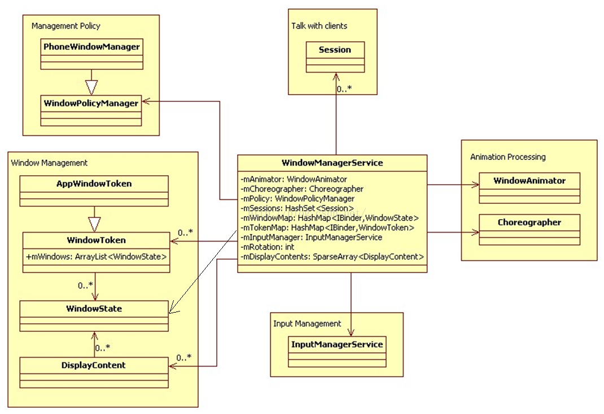

Android 中的窗口是屏幕上一块用于 显示各种视图 并且可以响应用户输出的 矩形区域。从原理上来说，窗口的是独占一个Surface实例的显示区域。而WindowsManagerService则是运行在系统进程中的用于 为窗口分配Surface,控制Surface的Z-order，位置，尺寸，窗口动画等功能的 一项重要服务，并且还是输入系统的一个中转站，负责转发输入系统的消息到具体的窗口进行响应。<!--more-->

Android中显示出一个窗口内容主要经过以下几个步骤：
1. 获取wms服务：`IWindowManager wms = IWindowManager.Stub.asInterface(ServiceManager.getService(Context.WINDOW_SERVICE))`
2. 获取窗口的Session：`mSession = WindowManagerGlobal.getWindowSession(Looper.myLooper)`
3. 添加窗口: `wms.addWindowToken() ; mSession.add(...)`
4. 确定窗口大小，尺寸:`mSession.relayout(...)`
5. renderFrames : `mChoreographer.postCallback(renderRunnable,...)`

在后面，我们分析RootView的时候会看到这些过程

Android的显示层次可以分为三层:
1. UI框架层，这里是在surface上绘制的ui元素和相应输入事件
2. wms, 这里是管理surface的分配，层级顺序等
3. surfaceflinger , 负责将多个Suface混合并输出

## wms的重要成员
1. mInputManager  , InputManagerService的实例
2. mChoreographer  , Choreographer的实例
3. mPolicy , WindowsPolicyManager的实例，目前只有PhoneWindowManager一个实现类。负责窗口的相关策略，比如告诉wms一个窗口的z-order是多少，为wms监听屏幕的旋转状态，矫正窗口属性，预处理Home,Back按键的默认行为等
4. mTokenMap , 一个Hashmap, 保存了窗口的令牌，一个窗口必须隶属于某个令牌。其中还有一些子集，比如有些是保存的windowToken,有些是保存的AppWindowToken等，其中AppWindowToken是有序的，和AMS中的mHistory列表保持一直，反映了系统中的Activity的顺序。和ams交互会用到
5. mWindowMap , 保存了 windowState 实例，用于窗口的管理，它也有一些自己，窗口在这个列表中的位置决定了窗口最终显示的Z序， windowState 主要用于wms通知客户端执行一些方法
6. mSessions , IWindowSession 的Bn端， IWindowSession 主要用于客户端通知wms执行一些方法

### WindowToken 
1. WindowToken 具有令牌的作用，是对应用组件的行为进行规范管理的一个手段。应用组件再需要新窗口时，必须提供WindowToken表明自己的身份，wms也会检查WindowToken和窗口的type直接的关联，保证一致。比如，Wallpaper只能创建 Type_WALLPAPER 类型的窗口，并且只有当前的Wallpaper才能创建窗口，因为其他的窗口没有有效的token.
2. WindowToken 将属于同一个应用组件的窗口组织在一起。比如在z-order排序的时候。
3. 对于客户端而言，Token仅仅是一个任意的Binder实例，对于wms而言，会生成一个对应的WindowToken并存储在map中。
4. AppWindowToken ,  AppWindowToken是为了管理Activity而创建的，它继承WindowToken并增加了一些新的功能。 对于AMS来说，AMS会为每一个Activity创建一个ActivityStack,这其中则包含了一个类型为IApplicationToken.Stub的appToken对象，在启动的过程中会把这个对象传给wms，wms则为它创建一个AppWindowToken，其中包含了IApplicationToken对象，这个对象实际上是一个远程代理接口，因此，wms可以在窗口变化的时候通知ams,而ams也可以通过ActivityStack在wms中找到对应的AppWindowToken，进而控制这个窗口的绘制和排序

### WindowState
上面说到WindowToken是wms与ams交互的数据结构，这里WindowState就是wms通知客户端的数据结构。客户端addWindow时会传入IWindow的Bn端，wms则会拿到IWindow的Bp端，当wms有需要的时候，则可以通过Bp端去调用Bn端的方法控制客户端，比如尺寸变化，焦点变化等。

## 窗口的显示顺序
Android系统会依据窗口的类型确定主序mBaseLayer,依据子窗口类型确定子序mSubLayer,最后根据一定的算法由主序子序以及其他参数（比如同类型的窗口出现的顺序，壁纸类型的窗口等）来计算出最终显示次序mLayer.

## 窗口的布局
窗口的布局本身其实就是一个计算窗口尺寸和位置的过程，但是因为窗口之间的关系，层次等原因，导致计算涉及到的变量特别多，因此变的非常复杂。主要的过程是：
1. 准备所需要的参数，比如屏幕尺寸，顶部状态栏/底部导航栏大小/可见性，屏幕旋转等
2. 计算顶级窗口的属性，保存在WindowState
3. 计算子窗口的属性，需要依赖第二步计算出的结果。
4. 完成一次布局，清理变量和资源

在一次布局完成后，窗口的属性计算并没有结束，因为窗口还有flag 属性没有计算进去，但是窗口的flag属性会影响窗口尺寸的计算，反过来窗口尺寸的计算也会影响到flag的有效性，因此 一次布局完成后，还需要根据flag再次进行布局计算，直到flag和窗口的属性都能一致为止。