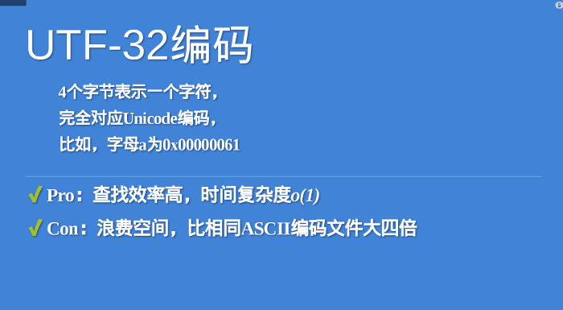

## Unicode与UCS的历史
Unicode源于一个很简单的想法：将全世界所有的字符包含在一个集合里，计算机只要支持这一个字符集，就能显示所有的字符，再也不会有乱码了。它从0开始，为每个符号指定一个编号，这叫做"码点"（code point）。比如，码点0的符号就是null（表示所有二进制位都是0）。
<!--more-->

Unicode的另一个设计目标，对今天影响深远，那就是对所有字符都采用16位编码（即用一个大小不超过2的16次方的整数数字给每个字符编号，注意从这个意义上也可以看出，Unicode是一种编码字符集，而非字符集编码）。但到后来连Unicode的设计者也发现，16位编码仅有65536个码位，远远不能容纳世界上所有的字符，但当意识到这个问题的时候，Unicode大部分的规范已经制定完毕，也有相当程度的普及，完全推倒重来是不现实的。这成了一个遗留问题，也是代理对（surrogate pair）这种蹩脚解决方案的发端。

无独有偶，在1984年，喜欢以繁多的编号糊弄群众的国际标准化组织ISO也开始着手制定解决不同语言字符数量太大问题的解决方案，这一方案被称为Universal Character Set（UCS），正式的编号是ISO-10646（记得么，ASCII是ISO-646，不知这种安排是否是故意的）。UCS-2用两个字节编码，UCS-4用4个字节编码。还是ISO高瞻远瞩，一开始就确定了UCS是一个31位的编码字符集（即用一个大小不超过2的31次方的整数数字为每个字符编号），这回真的足以容纳古往今来所有国家，所有语言所包含的字符了。虽然后来他们意识到，2的31次方个码位又实在太多了……

1991年，Unicode联盟与ISO的工作组终于开始讨论Unicode与UCS的合并问题。最终，两者统一了抽象字符集（即任何一个在Unicode中存在的字符，在UCS中也存在），且最靠前的65535个字符也统一了字符的编码。对于码空间，两者同意以一百一十万为限（即两者都认为虽然65536不够，但2的31次方又太大，一百一十万是个双方都可接受的码空间大小，也够用，当然，这里说的一百一十万只是个约数），Unicode将码空间扩展到了一百一十万，而UCS将永久性的不使用一百一十万以后的码位。也就是说，现在再讲Unicode只包含65536个字符是不对的。除了对已经定义的字符进行统一外，Unicode联盟与ISO工作组也同意今后任何的扩展工作两者均保持同步，因此虽然从历史的意义上讲Unicode与UCS不是一回事（甚至细节上说也不是一回事），但现在提起Unicode，指代两者均无不妥。

## GBK
早期的计算机使用7位的ASCII编码，为了处理汉字，程序员设计了用于简体中文的GB2312和用于繁体中文的big5。

GB2312(1980年)一共收录了7445个字符，包括6763个汉字和682个其它符号。汉字区的内码范围高字节从B0-F7，低字节从A1-FE，占用的码位是72*94=6768。其中有5个空位是D7FA-D7FE。在这个编码里，我们还把数学符号、罗马希腊的字母、日文的假名们都编进去了，连在 ASCII 里本来就有的数字、标点、字母都统统重新编了两个字节长的编码，这就是常说的”全角”字符，而原来在127号以下的那些就叫”半角”字符了。

GB2312支持的汉字太少。1995年的汉字扩展规范GBK1.0收录了21886个符号，它分为汉字区和图形符号区。汉字区包括21003个字符。

从ASCII、GB2312到GBK，这些编码方法是向下兼容的，即同一个字符在这些方案中总是有相同的编码，后面的标准支持更多的字符。在这些编码中，英文和中文可以统一地处理。区分中文编码的方法是高字节的最高位不为0。按照程序员的称呼，GB2312、GBK都属于双字节字符集 (DBCS)。

2000年的GB18030是取代GBK1.0的正式国家标准。该标准收录了27484个汉字，同时还收录了藏文、蒙文、维吾尔文等主要的少数民族文字。从汉字字汇上说，GB18030在GB13000.1的20902个汉字的基础上增加了CJK扩展A的6582个汉字（Unicode码0x3400-0x4db5），一共收录了27484个汉字。

CJK就是中日韩的意思。Unicode为了节省码位，将中日韩三国语言中的文字统一编码。GB13000.1就是ISO/IEC 10646-1的中文版，相当于Unicode 1.1。

GB18030的编码采用单字节、双字节和4字节方案。其中单字节、双字节和GBK是完全兼容的。4字节编码的码位就是收录了CJK扩展A的6582个汉字。 例如：UCS的0x3400在GB18030中的编码应该是8139EF30，UCS的0x3401在GB18030中的编码应该是8139EF31。


## Unicode转换格式（Uniform Transformation Format, UTF）

UCS-4根据最高位为0的最高字节分成27=128个group。每个group再根据次高字节分为256个平面（plane）。每个平面根据第3个字节分为256行 （row），每行有256个码位（cell）。group 0的平面0被称作BMP（Basic Multilingual Plane），其余的称为辅助平面（缩写SMP）。如果UCS-4的前两个字节为全零，那么将UCS-4的BMP去掉前面的两个零字节就得到了UCS-2。每个平面有216=65536个码位。Unicode计划使用了17个平面，一共有17×65536=1114112个码位。在Unicode 5.0.0版本中，已定义的码位只有238605个，分布在平面0、平面1、平面2、平面14、平面15、平面16。


Unicode只规定了每个字符的码点，现在，码点的范围是 0 至 0x10FFFF，码点又通常记作 U+XXXX，当中 XXXX 为 16 进位数字。Unicode没有规定这个二进制代码应该如何存储，现时流行的 UTF 为 UTF-8、UTF-16 和 UTF-32。每种 UTF 会把一个码点储存为一至多个编码单元（code unit）。例如 UTF-8 的编码单元是 8 位的字节、UTF-16 为 16 位、UTF-32 为 32 位。除 UTF-32 外，UTF-8 和 UTF-16 都是可变长度编码。

至于为什么要用utf,如果直接以原始码点来传输，每一个字符都将是两个字节以上，这对于英文为主的互联网来说，是非常浪费的，因为英文字母仅仅需要一个字节表示。

### utf-32
最直观的编码方法是，每个码点使用四个字节表示，字节内容一一对应码点。这种编码方法就叫做UTF-32。比如，码点0就用四个字节的0表示，码点597D就在前面加两个字节的0。
```
U+0000 = 0x0000 0000

U+597D = 0x0000 597D
```


UTF-32的优点在于，转换规则简单直观，查找效率高。缺点在于浪费空间，同样内容的英语文本，它会比ASCII编码大四倍。这个缺点很致命，导致实际上没有人使用这种编码方法，HTML 5标准就明文规定，网页不得编码成UTF-32。


### utf-16

UTF-16编码介于UTF-32与UTF-8之间，同时结合了定长和变长两种编码方法的特点。

它的编码规则很简单：基本平面的字符占用2个字节，辅助平面的字符占用4个字节。也就是说，UTF-16的编码长度要么是2个字节（U+0000到U+FFFF），要么是4个字节（U+010000到U+10FFFF）。


于是就有一个问题，当我们遇到两个字节，怎么看出它本身是一个字符，还是需要跟其他两个字节放在一起解读？

在基本平面内，从U+D800到U+DFFF是一个空段，即这些码点不对应任何字符。因此，这个空段可以用来映射辅助平面的字符。对应这些字符至少需要20个二进制位。

为什么是20个二进制位？辅助平面 的最大码位是0x10FFFF，减去0x10000后，最大值是0xFFFFF，所以肯定可以用20个二进制位表示

UTF-16将这20位拆成两半，前10位映射在U+D800到U+DBFF（空间大小210），称为高位（H），后10位映射在U+DC00到U+DFFF（空间大小210），称为低位（L）。这意味着，一个辅助平面的字符，被拆成两个基本平面的字符表示。 


Unicode码点转成UTF-16的时候，首先区分这是基本平面字符，还是辅助平面字符。如果是前者，直接将码点转为对应的十六进制形式，长度为两字节。

```
    U+597D = 0x597D
```
如果是辅助平面字符，Unicode 3.0版给出了转码公式。

```
    H = Math.floor((c-0x10000) / 0x400)+0xD800

    L = (c - 0x10000) % 0x400 + 0xDC00
```
以字符为例，它是一个辅助平面字符，码点为U+1D306，将其转为UTF-16的计算过程如下。

```
    H = Math.floor((0x1D306-0x10000)/0x400)+0xD800 = 0xD834

    L = (0x1D306-0x10000) % 0x400+0xDC00 = 0xDF06
```
所以，字符的UTF-16编码就是0xD834 0xDF06，长度为四个字节。


相应的，如果第一个码点是 U+D800 至 U+DBFF，我们便知道它的代码对的高代理项（high surrogate），之后应该伴随一个 U+DC00 至 U+DFFF 的低代理项（low surrogate）。然后，我们用下列公式把代理对 (H, L) 变换成真实的码点：

```
codepoint = 0x10000 + (H − 0xD800) × 0x400 + (L − 0xDC00)
```

举个例子，高音谱号字符 𝄞 → U+1D11E 不是 BMP 之内的字符。在 JSON 中可写成转义序列 \uD834\uDD1E，我们解析第一个 \uD834 得到码点 U+D834，我们发现它是 U+D800 至 U+DBFF 内的码点，所以它是高代理项。然后我们解析下一个转义序列 \uDD1E 得到码点 U+DD1E，它在 U+DC00 至 U+DFFF 之内，是合法的低代理项。我们计算其码点：
```
H = 0xD834, L = 0xDD1E
codepoint = 0x10000 + (H − 0xD800) × 0x400 + (L − 0xDC00)
          = 0x10000 + (0xD834 - 0xD800) × 0x400 + (0xDD1E − 0xDC00)
          = 0x10000 + 0x34 × 0x400 + 0x11E
          = 0x10000 + 0xD000 + 0x11E
          = 0x1D11E
```


### utf-8
UTF-8 的编码单元是 8 位字节，每个码点编码成 1 至 4 个字节。它的编码方式很简单，按照码点的范围，把码点的二进位分拆成 1 至最多 4 个字节：

```
码点范围 	      码点位数 	字节1 	        字节2 	         字节3 	         字节4
U+0000 ~ U+007F 	7 	0xxxxxxx 			
U+0080 ~ U+07FF 	11 	110xxxxx 	10xxxxxx 		
U+0800 ~ U+FFFF 	16 	1110xxxx 	10xxxxxx 	10xxxxxx 	
U+10000 ~ U+10FFFF 	21 	11110xxx 	10xxxxxx 	10xxxxxx 	10xxxxxx
```
这个编码方法的好处之一是，码点范围 U+0000 ~ U+007F 编码为一个字节，与 ASCII 编码兼容。这范围的 Unicode 码点也是和 ASCII 字符相同的。因此，一个 ASCII 文本也是一个 UTF-8 文本。

我们举一个例子解析多字节的情况，欧元符号 € → U+20AC：

1. U+20AC 在 U+0800 ~ U+FFFF 的范围内，应编码成 3 个字节。
2. U+20AC 的二进位为 10000010101100
3. 3 个字节的情况我们要 16 位的码点，所以在前面补两个 0，成为 0010000010101100
4. 按上表把二进位分成 3 组：0010, 000010, 101100
5. 加上每个字节的前缀：11100010, 10000010, 10101100
6. 用十六进位表示即：0xE2, 0x82, 0xAC


最后，是一个例子

作者：uuspider
链接：https://www.zhihu.com/question/23374078/answer/65352538

举一个例子：It's 知乎日报

你看到的unicode字符集是这样的编码表：
```
I 0049
t 0074
' 0027
s 0073
  0020
知 77e5
乎 4e4e
日 65e5
报 62a5
```
每一个字符对应一个十六进制数字。计算机只懂二进制，因此，严格按照unicode的方式(UCS-2)，应该这样存储：

```
I 00000000 01001001
t 00000000 01110100
' 00000000 00100111
s 00000000 01110011
  00000000 00100000
知 01110111 11100101
乎 01001110 01001110
日 01100101 11100101
报 01100010 10100101
```

这个字符串总共占用了18个字节，但是对比中英文的二进制码，可以发现，英文前9位都是0！浪费啊，浪费硬盘，浪费流量。怎么办？UTF。UTF-8是这样做的：
1. 单字节的字符，字节的第一位设为0，对于英语文本，UTF-8码只占用一个字节，和ASCII码完全相同；
2. n个字节的字符(n>1)，第一个字节的前n位设为1，第n+1位设为0，后面字节的前两位都设为10，这n个字节的其余空位填充该字符unicode码，高位用0补足。

这样就形成了如下的UTF-8标记位：
```
0xxxxxxx110xxxxx 
10xxxxxx1110xxxx 10xxxxxx 
10xxxxxx11110xxx 10xxxxxx 10xxxxxx 
10xxxxxx111110xx 10xxxxxx 10xxxxxx 10xxxxxx 
10xxxxxx1111110x 10xxxxxx 10xxxxxx 10xxxxxx 10xxxxxx 10xxxxxx
... ...

```
于是，”It's 知乎日报“就变成了：
```
I 01001001
t 01110100
' 00100111
s 01110011
  00100000
知 11100111 10011111 10100101
乎 11100100 10111001 10001110
日 11100110 10010111 10100101
报 11100110 10001010 10100101
```
和上边的方案对比一下，英文短了，每个中文字符却多用了一个字节。但是整个字符串只用了17个字节，比上边的18个短了一点点。


> 参考资料:
> 1. https://baike.baidu.com/item/UNICODE
> 2. https://www.zhihu.com/question/23374078
> 3. http://www.ruanyifeng.com/blog/2014/12/unicode.html

